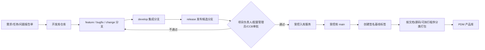
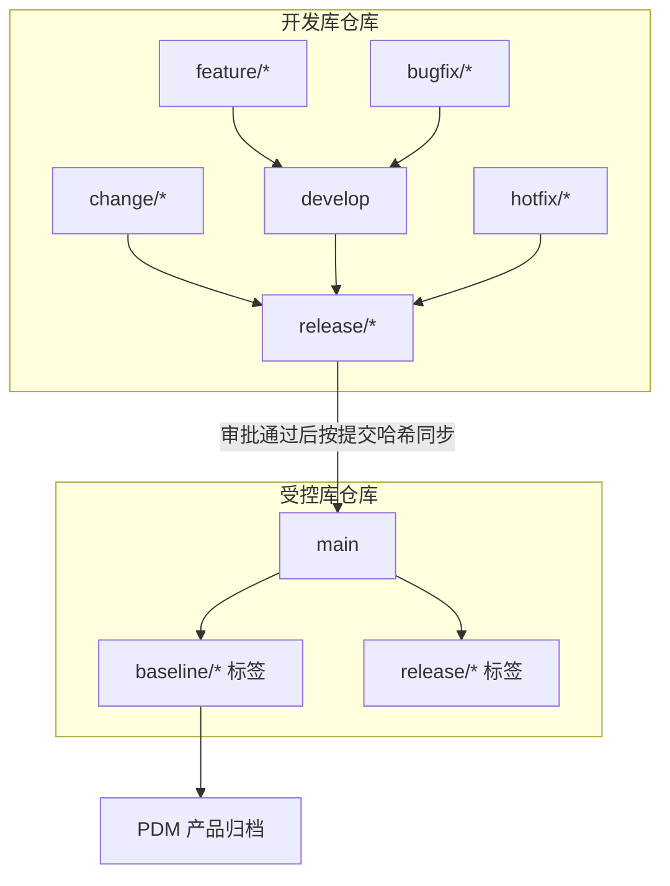
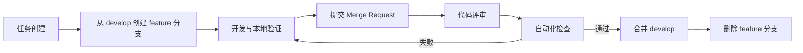
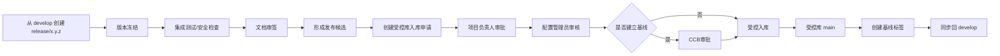
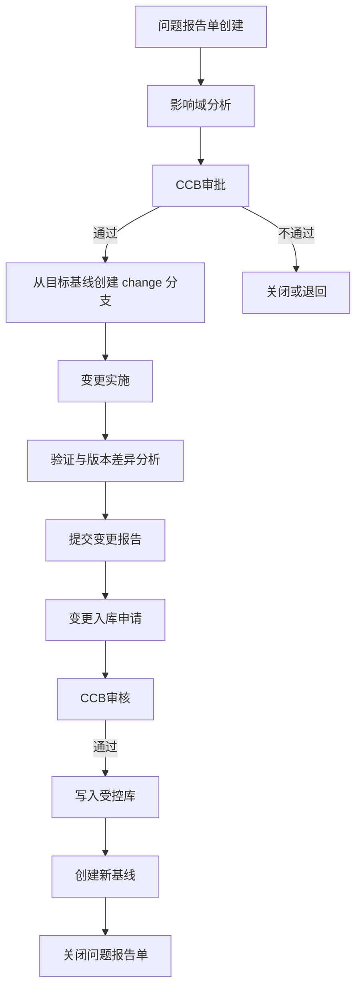

# Git Flow 版本管控策略方案设计

> 适用范围：软件集成研发环境、VISSLM CMRepo 开发库/受控库、PDM 产品库及构件库  
> 设计依据：`配置管理系统国产化替代解决方案20260626-V1.1.pptx` 第 11～23 页  
> 方案定位：面向军工研发配置管理场景的“受控 Git Flow”，兼顾研发效率、三库隔离、审批闭环、基线管理和审计追溯。

---

## 1. 方案摘要

本方案不直接将“开发库、受控库、产品库”简单映射为 `develop`、`main`、`release` 三条分支，而是采用：

> **双仓隔离 + 受控 Git Flow + 不可变基线标签 + 产品归档包**

- **开发库仓库**：承载日常开发、问题修复、文档更新、版本集成和发布候选验证。
- **受控库仓库**：仅接收经过审批的版本，禁止研发人员直接修改，保存正式受控版本和不可变基线。
- **产品库/PDM**：不作为研发分支使用，只接收从受控基线自动生成的标准化交付包。
- **Git Flow**：在开发库中组织功能开发、缺陷修复、受控变更和发布候选。
- **基线标签**：在受控库中固化正式版本，并关联审批单、变更单、构建产物和审计记录。

推荐总体模型：



---

## 2. 设计目标

### 2.1 业务目标

1. 保留原有建库、入库、出库、基线、变更和产品归档审批流程。
2. 将 Git 的分支、提交、合并请求和标签能力纳入配置管理制度。
3. 保证开发版本、受控版本和产品归档版本之间可追溯、可校验、不可混淆。
4. 支持问题报告单驱动的配置项变更闭环。
5. 支持源代码、软件文档、构建脚本、配置文件及构件的统一版本管控。
6. 保证所有受控操作由平台流程触发，研发人员不能绕过审批直接修改受控库。

### 2.2 管控目标

- **一项变更一个业务单据**
- **一个分支对应一个明确目标**
- **一次受控入库对应一个审批实例**
- **一个基线对应唯一提交快照**
- **一个产品包对应唯一受控基线**
- **任何文件均可追溯到提交人、审批人、变更原因和交付去向**

---

## 3. 核心设计原则

### 3.1 库与分支分层

“库”用于划分管理边界、权限边界和可信级别；“分支”用于组织版本演进过程。

| 对象 | 管理含义 | 是否允许日常开发 | 是否允许直接写入 |
|---|---|---:|---:|
| 开发库仓库 | 研发工作空间 | 是 | 受规则限制 |
| 受控库仓库 | 已审批配置项和正式基线 | 否 | 否 |
| 产品库/PDM | 正式交付和产品归档 | 否 | 仅系统归档 |
| Git 分支 | 某一类版本演进路径 | 视分支类型 | 视保护规则 |
| Git 标签 | 某一不可变版本点 | 否 | 仅授权角色创建 |

### 3.2 受控库不可直接开发

受控库仅允许以下两种写入方式：

1. 受控入库流程审批通过后，由平台集成账号写入。
2. 基于问题报告单的受控变更审批通过后，由平台集成账号写入。

任何研发人员、项目负责人和配置管理员均不得绕过流程直接向受控库 `main` 分支推送。

### 3.3 基线不可变

已发布基线不得移动、覆盖或删除。发现问题时：

- 不修改原基线；
- 从原基线派生变更分支；
- 完成审批、实施和验证；
- 创建新的受控提交和新基线。

### 3.4 业务单据强关联

以下对象必须建立关联：

```text
任务/需求/问题报告单
    → Git 分支
    → Commit
    → Merge Request
    → 审批实例
    → 受控提交
    → 基线标签
    → 构建产物
    → 产品归档包
```

---

## 4. 总体仓库架构

## 4.1 每个软件项目的推荐仓库

| 仓库 | 用途 | 主要内容 |
|---|---|---|
| `{project}-dev` | 开发库 | 日常源码、文档、脚本、配置文件、发布候选 |
| `{project}-controlled` | 受控库 | 审批通过的正式源码、文档和基线 |
| `{project}-component` | 可选构件库 | 可复用组件、公共模块、构件元数据 |
| PDM 产品库 | 产品归档 | 文档包、源码包、可执行程序包及归档清单 |

对于规模较小、保密等级和隔离要求较低的项目，可在同一 Git 仓库内使用严格保护分支模拟开发库和受控库；但面向正式军工配置管理场景，优先采用独立仓库，以强化权限隔离和审计边界。

## 4.2 开发库与受控库关系



---

## 5. 分支模型

## 5.1 长期分支

### `develop`

开发库主集成分支，用于汇总已经完成代码评审和基础验证的研发变更。

管控规则：

- 禁止直接推送；
- 必须通过 Merge Request 合并；
- 至少一名模块负责人评审；
- 必须通过自动化检查；
- 不允许未经关联任务的提交进入；
- 保持可构建、可测试状态。

### `main`

在开发库中可作为已确认发布版本的镜像；在受控库中代表当前正式受控版本。

受控库 `main` 规则：

- 全面禁止人工直接推送；
- 仅受控入库集成账号可写；
- 仅接收审批通过的精确提交；
- 每次写入后必须创建基线标签；
- 不允许强制推送、历史改写和删除；
- 不允许未经审批的回滚。

## 5.2 临时分支

| 分支 | 来源 | 合并目标 | 适用场景 |
|---|---|---|---|
| `feature/*` | `develop` | `develop` | 新功能、一般研发任务 |
| `bugfix/*` | `develop` | `develop` | 尚未进入正式基线的问题修复 |
| `docs/*` | `develop` 或指定版本 | `develop`/`release` | 软件文档编制和修订 |
| `release/*` | `develop` | 受控入库流程 | 发布候选、测试、审签和基线准备 |
| `change/*` | 指定受控基线 | `release/*` | 问题报告单驱动的受控配置项变更 |
| `hotfix/*` | 当前正式受控基线 | 受控入库流程 | 紧急生产问题修复 |
| `experiment/*` | `develop` | 原则上不直接合并 | 技术验证、原型实验 |

## 5.3 分支命名规范

```text
feature/<任务编号>-<简短描述>
bugfix/<缺陷编号>-<简短描述>
docs/<文档编号>-<简短描述>
release/<版本号>
change/<问题报告单编号>-<简短描述>
hotfix/<紧急问题编号>-<简短描述>
experiment/<任务编号>-<简短描述>
```

示例：

```text
feature/REQ-1024-user-permission
bugfix/BUG-0312-upload-timeout
docs/DOC-SRS-008-interface-update
release/2.3.0
change/PR-2026-0045-baseline-export
hotfix/ER-2026-001-login-failure
```

命名要求：

- 必须包含业务单据编号；
- 描述统一使用小写英文、数字和连字符；
- 禁止使用人员姓名作为分支名；
- 禁止创建 `test1`、`temp`、`new` 等无业务语义分支；
- 临时分支完成后自动删除，审计记录继续保留。

---

## 6. 三库流转策略

## 6.1 开发库

开发库承担：

- 功能开发；
- 缺陷修复；
- 软件文档编制；
- PDM 审签前后版本更新；
- 代码评审；
- 自动化构建和测试；
- 发布候选版本准备。

开发库内的文件尚未自动成为正式受控配置项。

## 6.2 受控库

进入受控库必须满足：

1. 已创建受控库入库申请；
2. 入库范围明确；
3. 关联版本或基线明确；
4. 项目负责人审批通过；
5. 配置管理员审核通过；
6. 需要建立基线时，CCB 审批通过；
7. 自动化校验通过；
8. 系统以服务账号写入受控库；
9. 系统创建不可变基线标签和基线清单。

推荐受控入库方式：

- 从开发库 `release/*` 获取确定的 Commit SHA；
- 在受控库写入同一文件树和提交内容；
- 保存开发库提交 SHA 与受控库提交 SHA 的映射；
- 创建签名基线标签；
- 自动生成入库差异清单。

## 6.3 产品库

产品库不接受分支推送。产品入库只能从受控库基线发起。

归档流程：

1. 选择一个已批准的基线标签；
2. 校验基线状态和审批状态；
3. 按规则分别生成：
   - 文档包；
   - 源代码完整工程包；
   - 可执行程序/制品包；
4. 生成统一归档清单和校验码；
5. 推送至 PDM；
6. 回写 PDM 归档编号；
7. 将产品归档记录关联至基线和审批单。

---

## 7. 标准研发流程

## 7.1 功能开发流程



控制要求：

- 一个功能分支原则上只对应一个任务；
- 大型任务可拆分多个分支，但必须归属同一父任务；
- 合并前必须解决冲突；
- 不允许将无关文件混入同一 Merge Request；
- Merge Request 必须说明变更内容、影响范围、验证结果和回退方案。

## 7.2 发布候选流程



发布分支只允许：

- 修复阻断发布的问题；
- 更新版本号；
- 更新发布说明；
- 更新待审签文档；
- 调整构建和打包配置。

禁止在发布分支中继续加入新的业务功能。

## 7.3 受控配置项变更流程

与问题报告单流程对齐：



关键规则：

- `change/*` 必须从问题所对应的受控基线创建，不能默认从最新 `develop` 创建；
- 分支必须记录原始基线 ID；
- 变更范围不得超出影响域分析结论；
- 合并前自动生成基线差异报告；
- 变更后必须产生新基线，不覆盖原基线；
- 问题报告单关闭前必须确认受控入库和基线创建成功。

## 7.4 紧急修复流程

`hotfix/*` 适用于已经正式发布、需要紧急处理的问题。

流程：

1. 发起紧急问题单；
2. 指定受影响的正式基线；
3. 从该基线创建 `hotfix/*`；
4. 完成修复、评审和最小必要验证；
5. 走紧急审批或补充审批流程；
6. 写入受控库并创建补丁基线；
7. 将修复同步回 `develop` 和仍在维护的 `release/*`；
8. 更新产品归档或补丁交付记录。

紧急流程不得免除审计，只能缩短审批链路或调整审批顺序。

---

## 8. 文档版本与 PDM 审签策略

软件文档可与源码存放在同一项目仓库，也可使用独立文档仓库。无论采用哪种方式，均遵循同一分支和基线规则。

## 8.1 开发阶段文档

- 文档更新使用 `docs/*`、`feature/*` 或对应 `change/*`；
- 文档提交必须包含文档编号和版本号；
- 文档版本由 Git 提交记录和文档元数据共同标识；
- 正式审签前的文档状态为“草稿”或“待审签”。

## 8.2 PDM 签署回传

PDM 完成审签后：

1. PDM 调用标准回调接口；
2. 平台校验文档编号、目标分支、原始版本和签署状态；
3. 由 PDM 集成账号提交签署完成的新版本；
4. Commit 中记录 PDM 审签单号；
5. 保留原始文档和签署文档的版本关系；
6. 若文档属于发布候选，签署版本只能提交至对应 `release/*`；
7. 若文档属于正式受控基线变更，必须提交至对应 `change/*`。

推荐自动提交格式：

```text
docs(DOC-SRS-008): import signed document from PDM

PDM-Approval: PDM-2026-0188
Source-Commit: a13f86d
Document-Version: V2.3
Signed-By: <签署流程返回标识>
```

---

## 9. 基线与标签策略

## 9.1 标签类型

| 标签类型 | 用途 | 示例 |
|---|---|---|
| 版本标签 | 标识软件发布版本 | `v2.3.0` |
| 基线标签 | 标识正式配置基线 | `BL-MODEL-A-CDR-2.3.0-20260720` |
| 补丁标签 | 标识紧急补丁 | `PATCH-2.3.1-20260725` |
| 产品归档标签 | 标识已进入 PDM 的版本 | `PRODUCT-2.3.0-PDM00128` |

## 9.2 基线命名

```text
BL-<项目/型号代码>-<阶段代码>-<版本号>-<日期>
```

示例：

```text
BL-X01-PDR-1.5.0-20260720
BL-X01-CDR-2.0.0-20261015
```

阶段代码由项目配置管理计划定义，如方案、初样、试样、定型等阶段，不在 Git 中写死。

## 9.3 基线清单

每个基线必须生成机器可读的基线清单，例如 `baseline-manifest.json`，至少包含：

```json
{
  "baselineId": "BL-X01-CDR-2.0.0-20261015",
  "project": "X01",
  "repository": "X01-controlled",
  "commit": "8e6b0d7...",
  "sourceRepository": "X01-dev",
  "sourceCommit": "4bd11c2...",
  "releaseBranch": "release/2.0.0",
  "approvalInstance": "APP-2026-01028",
  "ccbDecision": "approved",
  "createdBy": "cm-service",
  "createdAt": "2026-10-15T09:30:00+08:00",
  "artifacts": [],
  "documents": [],
  "checksums": []
}
```

## 9.4 标签保护

- 仅配置管理员或基线服务账号可以创建基线标签；
- 标签创建后不可移动；
- 禁止复用已存在的标签名；
- 删除标签必须走专门异常审批，且原则上仅允许删除错误创建、尚未对外交付的标签；
- 已产品归档的标签永久禁止删除。

---

## 10. Commit 管控规范

## 10.1 Commit 格式

推荐采用：

```text
<type>(<配置项或模块>): <变更摘要>

Issue: <任务/缺陷/问题报告单编号>
Impact: <影响范围>
Test: <验证方式>
```

类型建议：

| 类型 | 含义 |
|---|---|
| `feat` | 新功能 |
| `fix` | 缺陷修复 |
| `docs` | 文档变更 |
| `refactor` | 重构 |
| `test` | 测试变更 |
| `build` | 构建脚本或依赖 |
| `config` | 配置项变更 |
| `security` | 安全修复 |
| `revert` | 经批准的版本回退 |

示例：

```text
fix(upload): repair interrupted large-file retry

Issue: PR-2026-0045
Impact: uploader, checksum verification
Test: integration test and 20GB resumable upload test
```

## 10.2 Commit 原则

- 每次提交只解决一个明确问题；
- 禁止提交密码、令牌、私钥和未脱敏数据；
- 禁止在受保护分支使用 `force push`；
- 进入 `release/*` 后不得随意重写提交历史；
- 受控入库提交必须由平台生成并记录源提交哈希；
- 关键提交和基线标签建议使用平台支持的证书签名能力。

---

## 11. Merge Request 管控

## 11.1 必填内容

每个 Merge Request 必须包含：

- 关联业务单据；
- 变更目的；
- 配置项清单；
- 影响范围；
- 风险说明；
- 测试结果；
- 文档更新情况；
- 数据库或配置迁移说明；
- 回退方案；
- 是否影响既有基线；
- 是否需要 CCB 审批。

## 11.2 合并策略

| 合并路径 | 推荐策略 | 原因 |
|---|---|---|
| `feature/* → develop` | Squash Merge | 保持开发主线清晰 |
| `bugfix/* → develop` | Squash Merge | 聚合一次问题修复 |
| `docs/* → develop` | Squash 或 Rebase | 减少零散文档提交 |
| `develop → release/*` | 保留分支点 | 明确版本冻结范围 |
| `change/* → release/*` | Merge Commit | 保留受控变更边界 |
| `release/* → 受控库` | 精确提交同步 | 保证测试对象与入库对象一致 |
| `hotfix/* → 受控库` | Merge Commit/精确同步 | 保留紧急修复审计链路 |

## 11.3 自动化门禁

合并前至少检查：

- 分支名合法；
- 业务单据存在且状态允许；
- Commit 信息符合规范；
- 无未解决评审意见；
- 编译通过；
- 自动化测试通过；
- 静态检查通过；
- 敏感信息扫描通过；
- 开源依赖和许可证检查通过；
- 大文件和 LFS 规则符合要求；
- 受控变更范围与影响域分析一致；
- 发布候选版本号未被占用。

---

## 12. 角色与权限

## 12.1 角色定义

| 角色 | 主要职责 |
|---|---|
| 项目组成员 | 开发、提交、发起 Merge Request、发起出入库申请 |
| 模块负责人 | 代码和技术方案评审 |
| 软件项目负责人 | 版本范围确认、受控入库和出库审批 |
| 项目配置管理员 | 仓库、分支、权限、基线和受控入库管理 |
| 所配置管理员 | 跨项目配置审核、产品归档审核 |
| 质量人员 | 质量记录、交付完整性和流程符合性审核 |
| CCB 成员 | 配置基线建立和受控变更决策 |
| 安全保密管理员 | 密级、访问控制和安全策略管理 |
| 安全审计员 | 独立审计操作日志和异常行为 |
| 集成服务账号 | PDM 回传、受控入库、基线创建和归档自动化 |

## 12.2 权限矩阵

| 操作 | 项目成员 | 项目负责人 | 配置管理员 | CCB | 集成账号 |
|---|---:|---:|---:|---:|---:|
| 创建 `feature/*` | ✓ | ✓ | ✓ | — | — |
| 创建 `release/*` | — | ✓ | ✓ | — | ✓ |
| 创建 `change/*` | 申请后 | ✓ | ✓ | 审批 | ✓ |
| 推送普通开发分支 | ✓ | ✓ | ✓ | — | — |
| 直接推送 `develop` | × | × | × | × | × |
| 合并至 `develop` | 受评审限制 | ✓ | ✓ | — | ✓ |
| 写入受控库 `main` | × | × | × | × | ✓ |
| 创建基线标签 | × | × | 授权后 | 审批 | ✓ |
| 删除受控标签 | × | × | 异常审批后 | 审批 | ✓ |
| 受控库出库 | 申请 | 审批 | 执行/审核 | 视规则 | ✓ |
| 产品库归档 | × | 发起 | 审核 | 视规则 | ✓ |

---

## 13. 受控库展示与出库

## 13.1 展示规则

软件集成研发环境读取受控库时：

- 默认展示受控库 `main` 当前状态；
- 支持按基线标签浏览；
- 清晰区分“当前受控版本”和“历史基线”；
- 文件页面展示版本、最后变更人、审批单、基线和校验码；
- 普通研发人员仅具有读取权限；
- 所有下载和导出操作记录审计日志。

## 13.2 出库规则

受控库出库不等于 Git Clone。正式出库应通过平台流程：

1. 创建出库申请；
2. 选择基线或受控版本；
3. 明确用途、使用人和有效期；
4. 项目负责人审批；
5. 平台按基线精确打包；
6. 生成文件清单和校验码；
7. 提供受控下载链接；
8. 记录申请人、审批人、下载人、时间和客户端信息。

禁止通过共享账号直接克隆受控库代替出库流程。

---

## 14. 构件库版本策略

构件库建议采用独立仓库和独立版本号。

## 14.1 构件版本

```text
<主版本>.<次版本>.<修订版本>
```

- 主版本：存在不兼容变更；
- 次版本：新增向后兼容能力；
- 修订版本：缺陷修复或小范围调整。

## 14.2 构件入库

构件入库必须包含：

- 构件编号；
- 构件版本；
- 来源仓库和提交哈希；
- 对应基线；
- 构建环境；
- 依赖版本；
- 文件校验码；
- 测试报告；
- 适用项目范围。

## 14.3 构件变更

构件变更不得覆盖原版本。每次变更创建新版本和新标签，并记录受影响项目。

## 14.4 构件出库

默认出库明确版本，不建议仅使用“最新版本”。若业务页面提供“获取最新版本”，系统应将“最新”解析为当前已批准、未停用、适用范围匹配的最高正式版本，并在出库记录中固化实际版本号。

---

## 15. 权限与集成账号策略

## 15.1 人员账号

- 用户使用个人实名账号；
- 禁止多人共用账号；
- 仓库权限从建库申请单同步；
- 项目角色和仓库角色建立映射；
- 人员离岗、调岗后自动回收权限；
- 受控库权限不随开发库权限自动放大。

## 15.2 集成账号

按用途拆分：

| 账号 | 用途 |
|---|---|
| `svc-repo-provision` | 自动创建开发库/受控库和初始化权限 |
| `svc-pdm-sync` | PDM 审签文档回传 |
| `svc-controlled-import` | 审批通过后执行受控入库 |
| `svc-baseline` | 创建基线标签和清单 |
| `svc-product-archive` | 产品包生成与 PDM 归档 |
| `svc-backup` | 仓库、附件和元数据备份 |

要求：

- 最小权限；
- 凭据集中托管和定期轮换；
- 禁止交互式登录；
- 限定来源 IP 和调用接口；
- 所有调用写入独立审计日志；
- 不同环境不得共用同一凭据。

---

## 16. 备份与恢复策略

备份范围必须覆盖：

1. Git 仓库对象和引用；
2. Git LFS 或大文件存储；
3. 平台业务数据库；
4. 用户、角色和权限；
5. Merge Request、评审和审批映射；
6. 基线标签和基线清单；
7. 审计日志；
8. 产品归档记录；
9. 构建产物及校验码；
10. 系统配置和集成账号配置。

推荐策略：

| 类型 | 建议周期 | 说明 |
|---|---|---|
| 数据库增量备份 | 每小时或按项目要求 | 降低流程数据丢失范围 |
| 仓库增量备份 | 每日 | 覆盖新增 Git 对象和 LFS 文件 |
| 全量备份 | 每周 | 形成完整恢复点 |
| 基线归档备份 | 每次基线创建后 | 对正式基线立即固化 |
| 产品包备份 | 每次归档后 | 与 PDM 记录双向校验 |
| 恢复演练 | 每季度或按制度要求 | 验证仓库、权限和基线完整恢复 |

恢复验收至少校验：

- 分支和标签数量；
- 关键提交哈希；
- 基线清单；
- 文件校验码；
- 用户和权限；
- 审批与审计链路；
- 产品归档映射。

---

## 17. 第 11～23 页业务场景映射

| PPT 场景 | Git Flow 对应设计 |
|---|---|
| 11. 建立配置管理环境 | 自动创建开发库/受控库、初始化 `develop`/`main`、保护规则和角色权限 |
| 12. 开发库展示 | 展示开发库目录、分支、提交和版本，完整保留操作日志 |
| 13. 开发库文档签署 | PDM 回传签署文档，由集成账号提交至指定 `release/*` 或 `change/*` |
| 14. 受控库入库 | 从 `release/*` 选定精确提交，经审批后同步至受控库 `main` 并可创建基线 |
| 15. 问题报告单变更 | 从指定基线创建 `change/*`，完成影响分析、实施、差异分析和 CCB 入库 |
| 16. 基线创建 | 对受控库提交创建不可变签名标签和基线清单 |
| 17. 受控库出库 | 基于批准基线打包，不以普通 Clone 替代出库申请 |
| 18. 受控库展示 | 默认展示当前受控版本，支持按基线浏览和版本追溯 |
| 19. 产品库入库 | 从受控基线生成文档、源码、可执行程序三类归档包并推送 PDM |
| 20. 构件库入库/变更 | 构件独立版本化，变更创建新版本，不覆盖历史构件 |
| 21. 构件库出库 | 固化实际出库构件版本、使用人和用途 |
| 22. 权限管理 | 业务权限与 Git 仓库权限分离，集成账号最小权限 |
| 23. 库备份 | 同时备份数据库、Git 对象、LFS、基线、权限、审计和归档包 |

---

## 18. 自动化接口建议

软件集成研发环境与 VISSLM CMRepo 至少需要以下接口能力：

### 18.1 建库与权限

- 创建开发库和受控库；
- 初始化默认分支；
- 设置保护分支；
- 创建项目角色；
- 批量分配人员权限；
- 创建并绑定集成账号。

### 18.2 分支和版本

- 创建分支；
- 查询分支和提交；
- 获取文件树和文件版本；
- 创建 Merge Request；
- 查询评审结果；
- 获取精确 Commit SHA；
- 比较两个提交或基线差异。

### 18.3 受控入库

- 锁定发布候选；
- 校验审批实例；
- 同步指定提交到受控库；
- 创建基线标签；
- 生成基线清单；
- 回写入库结果。

### 18.4 出库与归档

- 按标签或 Commit 打包；
- 按文档、源码、制品分类；
- 生成校验码；
- 生成下载链接；
- 推送 PDM；
- 回写 PDM 归档编号。

### 18.5 审计

- 查询用户操作日志；
- 查询分支创建/删除记录；
- 查询受保护分支写入记录；
- 查询标签创建/删除记录；
- 查询集成账号调用日志；
- 导出版本、审批和归档追溯链。

---

## 19. 异常与回滚

## 19.1 开发库回滚

开发库优先使用 `revert` 生成反向提交，不建议重写公共分支历史。

## 19.2 受控库回滚

受控库不直接将 `main` 指针强制回退。正确方式：

1. 创建回滚问题单；
2. 选择目标基线；
3. 生成回滚变更；
4. 完成审批；
5. 创建一个内容等同于历史基线的新受控提交；
6. 创建新的回滚基线；
7. 保留原错误基线用于审计。

## 19.3 错误基线

- 尚未对外使用：走异常审批，可标记为“无效”，原则上不物理删除；
- 已用于出库或产品归档：永久保留，创建替代基线；
- 基线状态应包括：`草稿`、`待审批`、`有效`、`已替代`、`无效`、`已归档`。

---

## 20. 实施阶段

### 阶段一：规范落地

- 建立分支、Commit、Merge Request、标签和版本号规范；
- 确定项目角色和权限矩阵；
- 配置开发库保护规则；
- 建立业务单据与 Git 对象的关联字段。

### 阶段二：双仓和审批贯通

- 自动创建开发库和受控库；
- 实现发布候选提交锁定；
- 实现审批后自动受控入库；
- 实现基线标签和基线清单自动生成。

### 阶段三：PDM 和构件库集成

- 实现文档审签回传；
- 实现三类产品包自动归档；
- 建立构件版本和依赖追溯；
- 回写 PDM 归档编号。

### 阶段四：审计与智能检查

- 完善全链路审计台账；
- 建立异常推送和越权操作告警；
- 对接 MCP 智能审计；
- 自动检查基线完整性、流程合规性和交付包规范性。

---

## 21. 验收标准

### 21.1 流程验收

- 未审批版本无法进入受控库；
- 未通过 CCB 的变更无法创建正式基线；
- 产品库只能选择有效受控基线；
- PDM 签署文档能够准确回传到指定分支；
- 受控出库能够精确选择基线并生成完整清单。

### 21.2 权限验收

- 研发人员无法直接写入受控库；
- 配置管理员无法替代 CCB 完成审批；
- 审计员只读且无法修改业务数据；
- 集成账号仅能调用授权接口；
- 离岗人员权限能够及时回收。

### 21.3 追溯验收

任一产品归档包均可反向追溯到：

```text
PDM 归档编号
→ 产品包校验码
→ 受控基线
→ 受控提交
→ 发布候选
→ Merge Request
→ Commit
→ 分支
→ 任务/问题报告单
→ 实施人、评审人、审批人
```

### 21.4 数据验收

- 开发库与受控库同步内容校验一致；
- 基线标签与基线清单提交哈希一致；
- 大文件/LFS 对象无缺失；
- 仓库恢复后分支、标签、权限和审计链完整；
- 产品包与 PDM 归档记录一致。

---

## 22. 最终推荐

针对本项目，推荐采用以下正式策略：

1. **开发库和受控库使用独立 Git 仓库，形成物理或逻辑权限隔离。**
2. **标准 Git Flow 仅在开发库中运行，受控库不保留日常功能分支。**
3. **`develop` 负责研发集成，`release/*` 负责发布候选，`change/*` 负责问题单驱动的受控变更。**
4. **受控库 `main` 仅由审批流程驱动的集成账号写入。**
5. **所有正式版本通过不可变基线标签固化，产品归档必须从基线生成。**
6. **任何变更必须关联任务、问题报告单或审批单，形成端到端追溯链。**
7. **PDM 文档审签、构件入库、受控出库和产品归档均通过标准接口自动完成。**
8. **严禁以人工拷贝、共享账号、直接 Clone 或强制推送绕过配置管理流程。**

该方案既保留了 Git Flow 对并行研发和版本集成的支持，又将军工配置管理所要求的审批、三库隔离、基线冻结、变更闭环和审计追溯纳入统一管控。
