# 军工行业 DevOps 平台领域模型

> 文档状态：Draft v0.1  
> 更新日期：2026-07-13  
> 建模方法：Domain-Driven Design、统一语言、端到端可追溯、Full Stack Design System  
> 适用范围：面向军工软件研发与交付的 DevOps / DevSecOps 平台概念模型，不对应任何特定单位的涉密制度或具体系统数据。

## 0. 文档目的

本文档建立军工行业 DevOps 平台的完整领域模型，作为以下工作的共同语义基础：

- 建设领域术语词典和统一语言；
- 划分产品模块、导航和信息架构；
- 定义业务对象、对象视图和业务组件；
- 设计 API、数据模型、事件模型和权限模型；
- 建立需求、代码、构建、制品、验证、发布、部署之间的追溯链；
- 形成安全、质量、审批、证据和审计的横切治理体系；
- 连接 Figma 业务对象、Vue 组件、服务接口与持久化实体。

本文档承接以下两篇内部材料：

- [全栈设计系统解析](./全栈设计系统解析.md)
- [全栈设计系统实施方案](./全栈设计系统实施方案.md)

文档中的“军工行业”主要体现为更严格的配置管理、职责分离、访问控制、密级标记、基线管理、验证证据和全程审计。具体密级枚举、审批级次、保留期限和制度条款必须由实际单位配置，不能由本通用模型替代。

---

## 1. 领域边界

### 1.1 平台覆盖范围

平台覆盖从需求进入到运行反馈的完整闭环：

```text
项目与产品
  → 需求与任务
  → 配置与源码
  → 流水线与构建
  → 测试与质量
  → 安全与合规
  → 制品与供应链
  → 发布与变更
  → 环境与部署
  → 运行反馈
  → 缺陷、风险或新需求
```

所有环节由组织权限、审批工作流、证据审计、术语语义和度量分析五个横切子域约束。

### 1.2 暂不纳入的内容

- 武器装备本体、作战任务、战场数据等业务领域；
- 具体密码算法、密钥值和秘密载荷；
- 具体单位未公开的保密制度、审批级次和安全边界；
- Git、Jenkins、Kubernetes 等工具的全部内部对象；
- 财务、合同、采购和人力资源的完整业务模型；
- 生产运行系统的全部 ITSM/CMDB 能力。

这些内容可以通过组织级扩展、外部上下文或防腐层与本模型集成。

### 1.3 建模原则

1. **概念优先**：先定义业务对象和语义，再定义页面、表格和弹窗。
2. **定义与实例分离**：`PipelineDefinition` 不等于 `PipelineRun`，`TestCase` 不等于 `TestRun`。
3. **对象与评价分离**：制品生命周期、安全评价结果、可用性状态是不同维度。
4. **版本与当前值分离**：需求、流水线、策略、测试用例等受控对象通过版本实体冻结。
5. **事实与决策分离**：扫描结果是事实，闸门结果是策略评价，审批决定是人的授权。
6. **全程可追溯**：关键交付物必须能够向前追溯需求，向后追溯部署和证据。
7. **最小权限与职责分离**：创建者、验证者、审批者和发布者是否可由同一人承担，由策略显式决定。
8. **证据不可静默覆盖**：已经用于审批、发布或审计的证据只能追加新版本或撤销，不能原地修改。
9. **密级是独立维度**：密级不等于重要度、风险级别、漏洞严重度或处理优先级。
10. **通用核心、行业扩展、单位配置**：通用模型不硬编码具体单位的制度值。

---

## 2. 建模语言与公共约定

### 2.1 对象类型

| 类型 | 含义 | 示例 |
|---|---|---|
| Aggregate Root | 维护事务一致性边界的聚合根 | `Requirement`、`PipelineRun`、`Release` |
| Entity | 有稳定身份且可持续变化的实体 | `ApprovalTask`、`Finding` |
| Value Object | 由属性值定义、通常不可变的值对象 | `VersionNumber`、`ContentDigest` |
| Definition | 可复用的定义或模板 | `PipelineDefinition`、`WorkflowDefinition` |
| Version | 某一定义或对象的不可变版本 | `RequirementVersion`、`PolicyVersion` |
| Run | 一次执行实例 | `BuildRun`、`TestRun`、`ScanRun` |
| Evaluation | 基于输入事实和规则形成的评价 | `GateEvaluation`、`AccessDecision` |
| Decision | 由有权主体作出的决定 | `ApprovalDecision`、`ReleaseDecision` |
| Event | 已经发生且不可更改的领域事实 | `ArtifactPublished`、`DeploymentSucceeded` |
| Reference | 指向外部系统或敏感数据的引用 | `SecretReference`、`ExternalToolReference` |

### 2.2 公共字段

关键领域对象通常包含以下公共字段。并非所有对象都需要全部字段，但含义必须保持一致。

| 字段 | 含义 |
|---|---|
| `id` | 平台内稳定且不可复用的对象标识 |
| `conceptId` | 对应术语词典中的概念标识 |
| `organizationScopeId` | 对象所属组织或组织范围 |
| `programId` / `projectId` | 所属型号/项目或研发项目 |
| `securityLabelId` | 密级、知悉范围和处理规则的组合标签引用 |
| `ownerId` | 对业务结果负责的主体，不等同于创建者 |
| `version` | 乐观锁或领域版本，不与业务版本号混用 |
| `lifecycleStatus` | 对象自身的生命周期状态 |
| `createdBy` / `createdAt` | 创建主体和时间 |
| `updatedBy` / `updatedAt` | 最近更新主体和时间 |
| `sourceReference` | 外部系统或原始记录引用 |
| `auditContextId` | 关联审计上下文或操作链路 |

### 2.3 状态维度必须分离

| 维度                      | 回答的问题         | 示例                                  |
| ----------------------- | ------------- | ----------------------------------- |
| Lifecycle Status        | 对象处于什么生命周期阶段？ | Draft、Active、Released、Archived      |
| Execution Status        | 某次执行运行得怎样？    | Queued、Running、Succeeded、Failed     |
| Verification Status     | 是否已完成验证？      | Pending、Passed、Failed、Waived        |
| Decision Status         | 授权决定是什么？      | Pending、Approved、Rejected、Withdrawn |
| Availability Status     | 当前能否被使用？      | Available、Quarantined、Unavailable   |
| Severity                | 问题本身有多严重？     | Critical、High、Medium、Low            |
| Priority                | 处理顺序有多高？      | P0、P1、P2、P3                         |
| Security Classification | 信息允许被谁知悉？     | 由单位制度配置                             |

禁止使用一个无类型的 `status` 字段同时承载上述多个含义。

### 2.4 标识与版本规则

- 聚合根标识永久不变，不以名称、路径或数据库自增序号表达业务含义。
- 业务版本号与数据库记录版本分离，例如 `artifactVersion=1.4.2` 与 `rowVersion=17`。
- 已形成基线、签名、审批或发布引用的版本不得原地修改。
- 外部工具标识通过 `ExternalReference(system, type, externalId)` 保存。
- 内容完整性统一使用 `ContentDigest(algorithm, value)`，不能只保存文件名。
- 时间统一记录原始时区和 UTC 时间；审计展示时可转换为用户时区。

---

## 3. 总览模型

### 3.1 限界上下文总览

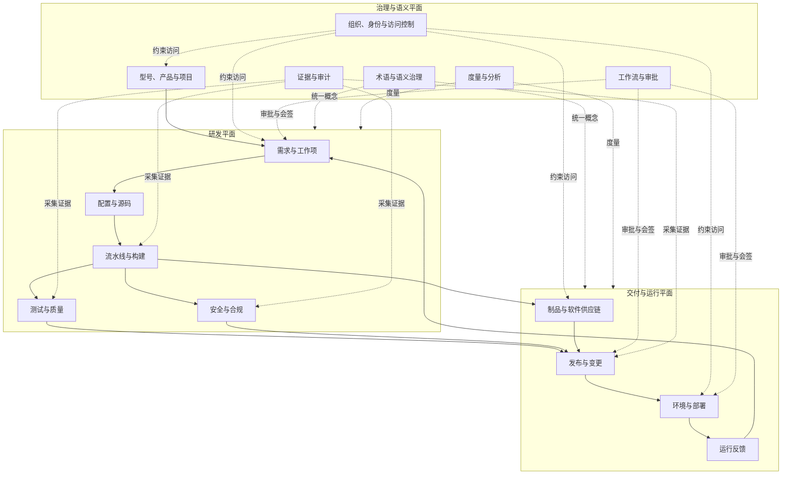
```mermaid
flowchart TB
  subgraph Governance[治理与语义平面]
    SEM[术语与语义治理]
    IAM[组织、身份与访问控制]
    PPM[型号、产品与项目]
    WFA[工作流与审批]
    EAU[证据与审计]
    MET[度量与分析]
  end

  subgraph Development[研发平面]
    REQ[需求与工作项]
    SCM[配置与源码]
    PIP[流水线与构建]
    TQM[测试与质量]
    SEC[安全与合规]
  end

  subgraph Delivery[交付与运行平面]
    ART[制品与软件供应链]
    REL[发布与变更]
    DEP[环境与部署]
    OPS[运行反馈]
  end

  PPM --> REQ
  REQ --> SCM
  SCM --> PIP
  PIP --> TQM
  PIP --> SEC
  PIP --> ART
  TQM --> REL
  SEC --> REL
  ART --> REL
  REL --> DEP
  DEP --> OPS
  OPS --> REQ

  IAM -.约束访问.-> PPM
  IAM -.约束访问.-> REQ
  IAM -.约束访问.-> ART
  IAM -.约束访问.-> DEP
  WFA -.审批与会签.-> REQ
  WFA -.审批与会签.-> REL
  WFA -.审批与会签.-> DEP
  EAU -.采集证据.-> PIP
  EAU -.采集证据.-> TQM
  EAU -.采集证据.-> SEC
  EAU -.采集证据.-> REL
  SEM -.统一概念.-> Development
  SEM -.统一概念.-> Delivery
  MET -.度量.-> Development
  MET -.度量.-> Delivery
```

### 3.2 上下文目录

| 编号 | 限界上下文 | 核心职责 | 核心聚合 |
|---|---|---|---|
| BC-01 | 术语与语义治理 | 管理统一语言、定义、关系和全栈映射 | Glossary、Concept |
| BC-02 | 组织、身份与访问控制 | 管理组织、用户、角色、授权和密级标签 | Organization、Principal、AccessPolicy |
| BC-03 | 型号、产品与项目 | 建立型号/项目、产品结构和研发工作空间 | Program、Product、Project |
| BC-04 | 需求与工作项 | 管理需求、任务、缺陷、变更和追溯 | Requirement、WorkItem、ChangeRequest |
| BC-05 | 配置与源码 | 管理配置项、代码仓库、评审和基线 | ConfigurationItem、Repository、Baseline |
| BC-06 | 流水线与构建 | 管理自动化定义、执行和构建输出 | PipelineDefinition、PipelineRun、BuildRun |
| BC-07 | 测试与质量 | 管理测试资产、执行事实、质量规则和评价 | TestPlan、TestRun、QualityGate |
| BC-08 | 安全与合规 | 管理安全要求、控制、扫描、发现项、风险和安全闸门 | ControlProfile、ScanRun、Finding、SecurityGate |
| BC-09 | 制品与软件供应链 | 管理制品、依赖、SBOM、来源证明和签名 | Artifact、ArtifactVersion、ArtifactRepository |
| BC-10 | 工作流与审批 | 编排人工任务、评审、会签和授权决定 | WorkflowDefinition、WorkflowInstance、ApprovalTask |
| BC-11 | 发布与变更 | 组织候选交付内容、发布决策和回退计划 | Release、ReleaseCandidate |
| BC-12 | 环境与部署 | 管理环境、目标、部署、晋级和回滚 | Environment、DeploymentPlan、Deployment |
| BC-13 | 运行反馈 | 管理服务实例、告警、事件和研发反馈 | ServiceInstance、Incident、Problem |
| BC-14 | 证据与审计 | 固化证据、审计事件、证据包和保留策略 | Evidence、EvidenceBundle、AuditTrail |
| BC-15 | 度量与分析 | 定义指标、采集测量值并形成可解释分析 | MetricDefinition、Measurement、Dashboard |

### 3.3 端到端数字主线

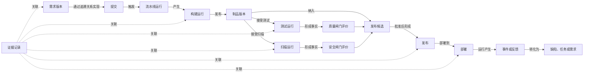
```mermaid
flowchart LR
  RV[需求版本] -->|通过追溯关系实现| C[提交]
  C -->|触发| PR[流水线运行]
  PR -->|产生| BR[构建运行]
  BR -->|发布| AV[制品版本]
  AV -->|接受测试| TR[测试运行]
  AV -->|接受扫描| SR[扫描运行]
  TR -->|形成事实| QGE[质量闸门评价]
  SR -->|形成事实| SGE[安全闸门评价]
  AV -->|纳入| RC[发布候选]
  QGE --> RC
  SGE --> RC
  RC -->|批准后形成| R[发布]
  R -->|部署到| D[部署]
  D -->|运行产生| I[事件或反馈]
  I -->|转化为| WI[缺陷、任务或需求]

  E[证据记录] -.关联.-> RV
  E -.关联.-> BR
  E -.关联.-> TR
  E -.关联.-> SR
  E -.关联.-> R
  E -.关联.-> D
```

数字主线的最小可回答问题是：

- 某个部署实例来自哪个发布和制品版本？
- 某个制品由哪次构建、哪份源码和哪个流水线版本产生？
- 哪些需求、缺陷和变更进入了该发布？
- 发布前使用了哪些测试、安全和审批证据？
- 谁在什么授权范围内作出了什么决定？
- 运行问题影响了哪些制品、发布、部署和原始需求？

### 3.4 横切关系

每个关键业务对象都应通过引用接入以下横切能力：

```text
BusinessObject
├── conceptId              统一术语
├── organizationScopeId    组织边界
├── securityLabelId        密级与知悉范围
├── workflowInstanceId     审批或评审过程
├── evidenceRefs[]         证据引用
├── auditContextId         审计链路
└── metricDimensions       度量维度
```

---

## 4. 子模型 BC-01：术语与语义治理

### 4.1 职责边界

该上下文维护产品的统一语言。它定义“一个概念是什么”，不保存流水线、制品等业务对象的运行数据。

### 4.2 对象模型

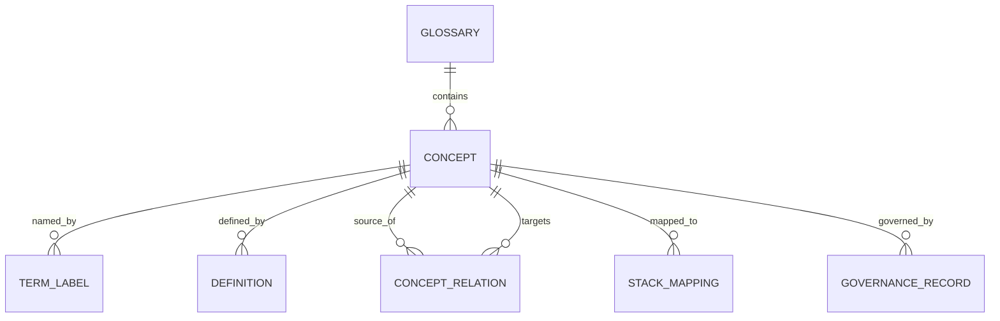
```mermaid
erDiagram
  GLOSSARY ||--o{ CONCEPT : contains
  CONCEPT ||--o{ TERM_LABEL : named_by
  CONCEPT ||--o{ DEFINITION : defined_by
  CONCEPT ||--o{ CONCEPT_RELATION : source_of
  CONCEPT ||--o{ STACK_MAPPING : mapped_to
  CONCEPT ||--o{ GOVERNANCE_RECORD : governed_by
  CONCEPT_RELATION }o--|| CONCEPT : targets
```

| 对象 | 类型 | 关键信息 |
|---|---|---|
| `Glossary` | Aggregate Root | 名称、适用范围、语言、版本、维护组织、发布状态 |
| `Concept` | Entity | `conceptId`、术语类型、领域、定义边界、重要度 |
| `TermLabel` | Entity | 中文/英文首选名、缩写、允许别名、历史名、禁用名 |
| `Definition` | Entity | 一句话定义、完整定义、适用范围、排除项、示例、反例 |
| `ConceptRelation` | Entity | 上下位、组成、产生、验证、输入输出、追溯等有向关系 |
| `StackMapping` | Entity | UI 标签、Figma 对象、组件名、API 名、数据实体、事件名 |
| `GovernanceRecord` | Entity | 来源、条款、负责人、审核人、版本、生效日期、变更记录 |

### 4.3 关键规则

- 一个概念在同一语言和适用范围内只能有一个首选名称。
- 同名异义必须建立不同的 `conceptId`，不能靠描述字段临时区分。
- 禁用名称必须说明原因并指向替代概念。
- `Concept` 废弃后标识不可复用；历史数据仍可解析其含义。
- 业务对象、状态、动作、角色、策略和指标必须使用不同的术语类型。
- 已发布术语的实质性定义变更必须形成新版本并触发影响分析。

### 4.4 领域事件

`ConceptProposed`、`ConceptApproved`、`ConceptDefinitionChanged`、`PreferredLabelChanged`、`ConceptDeprecated`、`GlossaryPublished`。

---

## 5. 子模型 BC-02：组织、身份与访问控制

### 5.1 职责边界

管理谁以什么身份、在什么组织和项目范围内、基于什么安全条件，可以对什么资源执行什么动作。

### 5.2 对象模型

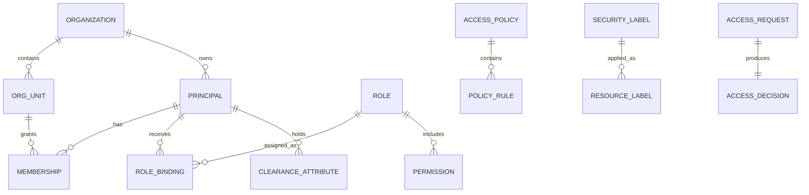
```mermaid
erDiagram
  ORGANIZATION ||--o{ ORG_UNIT : contains
  ORGANIZATION ||--o{ PRINCIPAL : owns
  PRINCIPAL ||--o{ MEMBERSHIP : has
  ORG_UNIT ||--o{ MEMBERSHIP : grants
  PRINCIPAL ||--o{ ROLE_BINDING : receives
  ROLE ||--o{ ROLE_BINDING : assigned_as
  ROLE ||--o{ PERMISSION : includes
  ACCESS_POLICY ||--o{ POLICY_RULE : contains
  SECURITY_LABEL ||--o{ RESOURCE_LABEL : applied_as
  PRINCIPAL ||--o{ CLEARANCE_ATTRIBUTE : holds
  ACCESS_REQUEST ||--|| ACCESS_DECISION : produces
```

| 对象 | 类型 | 关键信息 |
|---|---|---|
| `Organization` | Aggregate Root | 组织标识、组织类型、上级组织、有效期 |
| `OrgUnit` | Entity | 部门/团队、层级路径、负责人、组织范围 |
| `Principal` | Aggregate Root | 用户、服务账号或外部系统主体；身份状态、认证来源 |
| `Membership` | Entity | 主体与组织单元的隶属关系、岗位、有效期 |
| `Role` | Aggregate Root | 角色名称、职责、互斥角色集合、适用范围 |
| `Permission` | Value Object | `resourceType + action + condition` |
| `RoleBinding` | Entity | 主体、角色、资源范围、授予依据、起止时间 |
| `AccessPolicy` | Aggregate Root | 策略版本、规则组合、优先级、默认效果 |
| `SecurityLabel` | Aggregate Root | 密级等级引用、分区/项目范围、知悉约束、处理说明 |
| `ClearanceAttribute` | Entity | 主体授权等级和范围引用，不保存敏感证明正文 |
| `AccessRequest` | Entity | 主体、资源、动作、环境、请求时间 |
| `AccessDecision` | Entity | Allow/Deny、命中规则、解释、决策时间 |

### 5.3 授权判定模型

```text
AccessDecision = f(
  PrincipalStatus,
  AuthenticationContext,
  RolePermissions,
  OrganizationScope,
  ProjectScope,
  ResourceSecurityLabel,
  PrincipalClearanceAttributes,
  SeparationOfDuties,
  EnvironmentAndTimeConditions
)
```

### 5.4 关键规则

- 角色授予必须有作用域和有效期；永久全局授权应作为例外审计。
- 删除用户不能删除历史审计主体，只能使身份失效。
- 密级判定、组织范围和业务权限必须同时满足，任何一项不满足即拒绝。
- 访问决策必须可解释并记录命中的策略版本。
- 服务账号与自然人账号分离，服务账号不得参与人工审批。
- 职责分离规则应支持“创建者不能审批”“构建者不能独立发布”等约束。

### 5.5 领域事件

`PrincipalActivated`、`PrincipalDisabled`、`RoleGranted`、`RoleRevoked`、`SecurityLabelChanged`、`AccessDenied`、`PolicyPublished`。

---

## 6. 子模型 BC-03：型号、产品与项目

### 6.1 职责边界

建立研发活动的业务归属和产品分解结构。“型号”作为可配置的行业扩展概念；不适用的单位可将其映射为计划、项目群或产品线。

### 6.2 对象模型

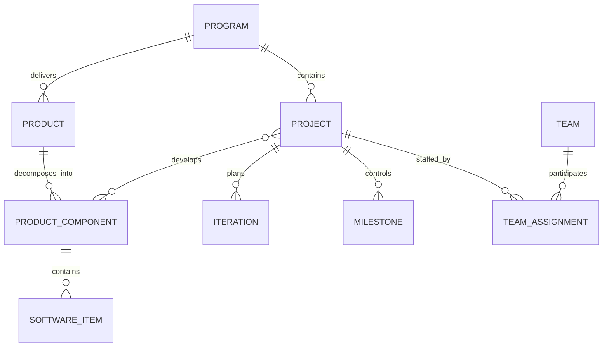
```mermaid
erDiagram
  PROGRAM ||--o{ PROJECT : contains
  PROGRAM ||--o{ PRODUCT : delivers
  PRODUCT ||--o{ PRODUCT_COMPONENT : decomposes_into
  PRODUCT_COMPONENT ||--o{ SOFTWARE_ITEM : contains
  PROJECT }o--o{ PRODUCT_COMPONENT : develops
  PROJECT ||--o{ ITERATION : plans
  PROJECT ||--o{ MILESTONE : controls
  PROJECT ||--o{ TEAM_ASSIGNMENT : staffed_by
  TEAM ||--o{ TEAM_ASSIGNMENT : participates
```

| 对象 | 类型 | 关键信息 |
|---|---|---|
| `Program` | Aggregate Root | 型号/计划标识、名称、责任组织、阶段、密级标签 |
| `Product` | Aggregate Root | 产品标识、产品类型、版本策略、负责人 |
| `ProductComponent` | Entity | 系统、分系统、模块等产品分解节点，支持树形层级 |
| `SoftwareItem` | Entity | 可独立配置、验证或交付的软件项 |
| `Project` | Aggregate Root | 研发工作空间、目标、范围、起止时间、当前阶段 |
| `Iteration` | Entity | 迭代目标、时间盒、状态 |
| `Milestone` | Entity | 里程碑准入条件、计划/实际日期、完成证据 |
| `Team` | Aggregate Root | 团队名称、组织归属、负责人 |
| `TeamAssignment` | Entity | 团队/成员在项目中的职责和有效期 |

### 6.3 关键规则

- `Program`、`Product`、`Project` 是不同概念：计划/型号组织长期目标，产品是交付对象，项目是完成工作的临时边界。
- 一个需求、仓库、制品、发布和环境必须能追溯到至少一个 `Project` 或 `Product`。
- 产品分解节点的移动必须执行影响分析，不能破坏历史基线引用。
- 项目归档后禁止新增研发数据，但允许查看、审计和受控恢复。
- 里程碑完成必须引用准入条件的验证结果或批准的豁免。

### 6.4 项目状态

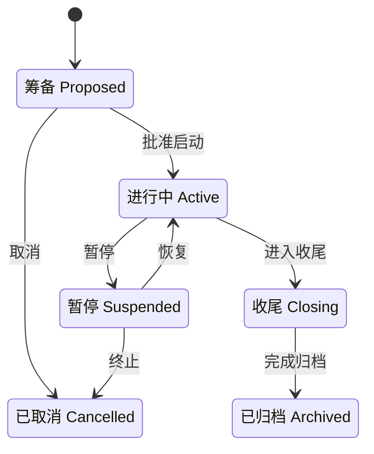
```mermaid
stateDiagram-v2
  state "筹备 Proposed" as Proposed
  state "进行中 Active" as Active
  state "暂停 Suspended" as Suspended
  state "收尾 Closing" as Closing
  state "已归档 Archived" as Archived
  state "已取消 Cancelled" as Cancelled

  [*] --> Proposed
  Proposed --> Active: 批准启动
  Proposed --> Cancelled: 取消
  Active --> Suspended: 暂停
  Suspended --> Active: 恢复
  Active --> Closing: 进入收尾
  Closing --> Archived: 完成归档
  Suspended --> Cancelled: 终止
```

### 6.5 领域事件

`ProgramCreated`、`ProductStructureChanged`、`ProjectActivated`、`MilestoneReached`、`ProjectArchived`。

---

## 7. 子模型 BC-04：需求与工作项

### 7.1 职责边界

管理从用户/系统目标到软件需求、执行任务、缺陷和受控变更的全过程，并通过追溯关系连接验证和实现。

### 7.2 对象模型

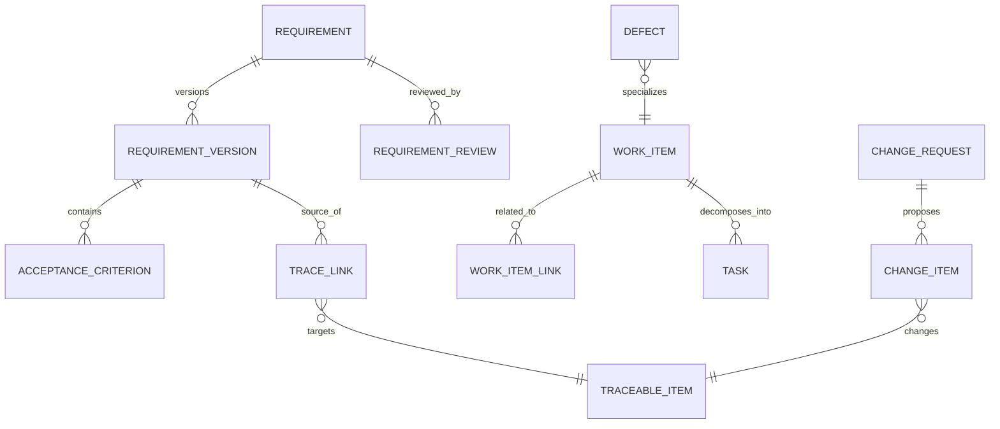
```mermaid
erDiagram
  REQUIREMENT ||--o{ REQUIREMENT_VERSION : versions
  REQUIREMENT_VERSION ||--o{ ACCEPTANCE_CRITERION : contains
  REQUIREMENT_VERSION ||--o{ TRACE_LINK : source_of
  TRACE_LINK }o--|| TRACEABLE_ITEM : targets
  REQUIREMENT ||--o{ REQUIREMENT_REVIEW : reviewed_by
  WORK_ITEM ||--o{ WORK_ITEM_LINK : related_to
  WORK_ITEM ||--o{ TASK : decomposes_into
  DEFECT }o--|| WORK_ITEM : specializes
  CHANGE_REQUEST ||--o{ CHANGE_ITEM : proposes
  CHANGE_ITEM }o--|| TRACEABLE_ITEM : changes
```

| 对象 | 类型 | 关键信息 |
|---|---|---|
| `Requirement` | Aggregate Root | 稳定标识、类型、来源、负责人、生命周期 |
| `RequirementVersion` | Entity | 标题、正文、理由、优先级、验证方法、版本状态 |
| `AcceptanceCriterion` | Entity | 可验证条件、预期结果、验证方式 |
| `TraceLink` | Entity | 来源、目标、关系类型、覆盖理由、验证状态 |
| `RequirementReview` | Entity | 评审范围、评审人、意见、结论、证据 |
| `WorkItem` | Aggregate Root | 工作类型、标题、负责人、优先级、计划信息 |
| `Task` | Entity | 可执行工作、估算、完成定义 |
| `Defect` | Aggregate Root | 现象、复现条件、影响版本、严重度、根因和修复版本 |
| `ChangeRequest` | Aggregate Root | 变更原因、影响范围、紧急度、提出人、决定 |
| `ChangeItem` | Entity | 被新增、修改、废弃或替换的受控对象引用 |

### 7.3 追溯关系类型

| 关系 | 含义 |
|---|---|
| `derivesFrom` | 下层需求来源于上层需求 |
| `refines` | 对目标概念进行细化 |
| `satisfies` | 实现对象满足某项需求 |
| `verifies` | 测试或证据验证需求 |
| `implements` | 工作项、提交或变更实现需求 |
| `affects` | 缺陷、风险或变更影响目标对象 |
| `supersedes` | 新版本或新对象替代旧对象 |
| `duplicates` | 表示概念或问题重复 |

### 7.4 需求状态

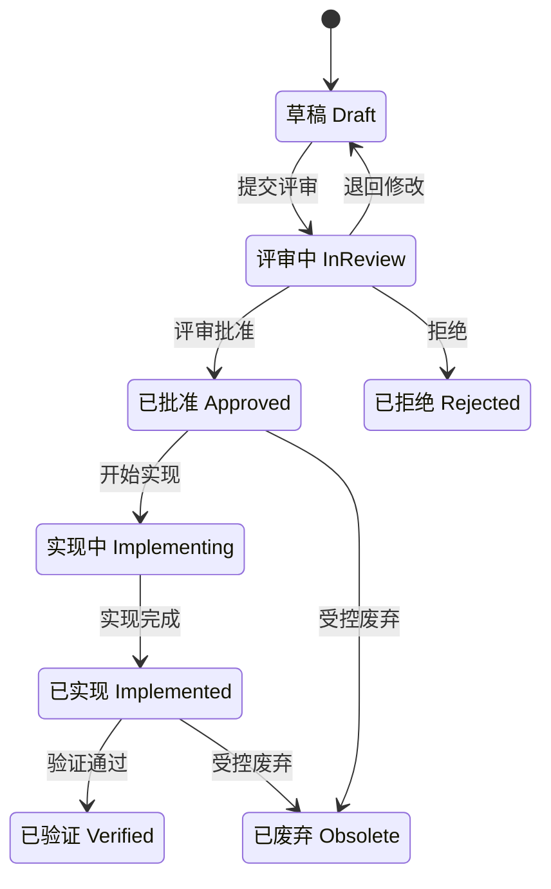
```mermaid
stateDiagram-v2
  state "草稿 Draft" as Draft
  state "评审中 InReview" as InReview
  state "已批准 Approved" as Approved
  state "实现中 Implementing" as Implementing
  state "已实现 Implemented" as Implemented
  state "已验证 Verified" as Verified
  state "已废弃 Obsolete" as Obsolete
  state "已拒绝 Rejected" as Rejected

  [*] --> Draft
  Draft --> InReview: 提交评审
  InReview --> Draft: 退回修改
  InReview --> Approved: 评审批准
  InReview --> Rejected: 拒绝
  Approved --> Implementing: 开始实现
  Implementing --> Implemented: 实现完成
  Implemented --> Verified: 验证通过
  Approved --> Obsolete: 受控废弃
  Implemented --> Obsolete: 受控废弃
```

### 7.5 关键规则

- 需求正文发生实质变化必须形成 `RequirementVersion`，不能覆盖已批准内容。
- 已批准需求必须具有来源、责任人和至少一种验证方法。
- “任务完成”不能自动推导“需求已验证”。
- 需求状态、实现进度和验证结果必须分离。
- 变更请求批准前只表达提议，不能直接修改受控基线。
- 高影响变更必须完成影响分析，至少覆盖需求、代码、测试、制品、发布和文档。
- 关闭缺陷必须指向修复提交和验证结果；无法修复则需要批准的风险接受或豁免。

### 7.6 领域事件

`RequirementSubmitted`、`RequirementApproved`、`RequirementChanged`、`TraceLinkCreated`、`DefectConfirmed`、`ChangeRequestApproved`、`RequirementVerified`。

---

## 8. 子模型 BC-05：配置与源码

### 8.1 职责边界

管理需要受控的配置项、源码仓库、变更评审、版本标识和配置基线。外部 Git 平台通过适配器接入，本上下文保留平台统一语义。

### 8.2 对象模型

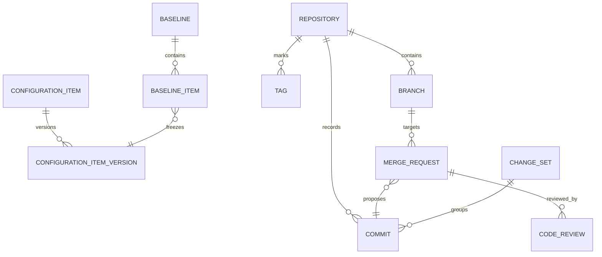
```mermaid
erDiagram
  CONFIGURATION_ITEM ||--o{ CONFIGURATION_ITEM_VERSION : versions
  REPOSITORY ||--o{ BRANCH : contains
  REPOSITORY ||--o{ COMMIT : records
  BRANCH ||--o{ MERGE_REQUEST : targets
  MERGE_REQUEST }o--|| COMMIT : proposes
  MERGE_REQUEST ||--o{ CODE_REVIEW : reviewed_by
  REPOSITORY ||--o{ TAG : marks
  BASELINE ||--o{ BASELINE_ITEM : contains
  BASELINE_ITEM }o--|| CONFIGURATION_ITEM_VERSION : freezes
  CHANGE_SET ||--o{ COMMIT : groups
```

| 对象 | 类型 | 关键信息 |
|---|---|---|
| `ConfigurationItem` | Aggregate Root | 配置项类型、责任人、标识规则、控制级别 |
| `ConfigurationItemVersion` | Entity | 版本号、内容摘要、来源、批准状态 |
| `Repository` | Aggregate Root | 仓库类型、默认分支、托管系统引用、访问策略 |
| `Branch` | Entity | 分支名、来源提交、保护策略、生命周期 |
| `Commit` | Entity | 提交摘要、作者/提交者、签名状态、父提交、消息 |
| `MergeRequest` | Aggregate Root | 源/目标分支、变更范围、关联需求、合并状态 |
| `CodeReview` | Entity | 评审者、意见、结论、版本、时间 |
| `Tag` | Entity | 标签名、目标提交、签名、是否受保护 |
| `Baseline` | Aggregate Root | 基线类型、名称、版本、状态、批准记录 |
| `BaselineItem` | Entity | 配置项版本、内容摘要、纳入理由 |
| `ChangeSet` | Aggregate Root | 一组关联提交、需求和变更请求 |

### 8.3 合并请求状态

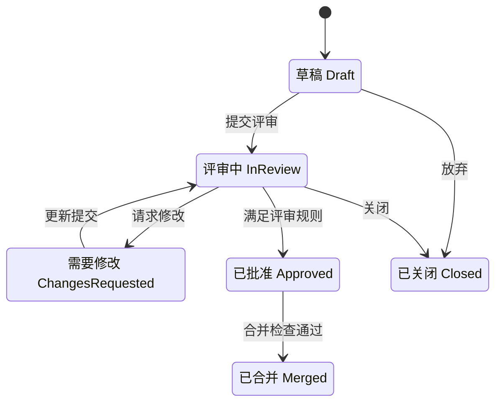
```mermaid
stateDiagram-v2
  state "草稿 Draft" as Draft
  state "评审中 InReview" as InReview
  state "需要修改 ChangesRequested" as ChangesRequested
  state "已批准 Approved" as Approved
  state "已合并 Merged" as Merged
  state "已关闭 Closed" as Closed

  [*] --> Draft
  Draft --> InReview: 提交评审
  InReview --> ChangesRequested: 请求修改
  ChangesRequested --> InReview: 更新提交
  InReview --> Approved: 满足评审规则
  Approved --> Merged: 合并检查通过
  Draft --> Closed: 放弃
  InReview --> Closed: 关闭
```

### 8.4 关键规则

- 基线不是标签或快照；基线是经过批准、具有明确用途的配置项版本集合。
- 受保护分支的合并必须满足评审、签名、检查和职责分离策略。
- 合并请求每次关键更新后，应使旧评审结论失效或重新确认。
- 提交的作者、提交者和签名主体分别记录。
- 基线批准后内容不可修改；变更必须产生新基线版本。
- 配置项版本必须能够映射到内容摘要，避免仅依赖可变路径。

### 8.5 领域事件

`CommitReceived`、`MergeRequestOpened`、`CodeReviewApproved`、`MergeCompleted`、`BaselineProposed`、`BaselineApproved`、`BaselineSuperseded`。

---

## 9. 子模型 BC-06：流水线与构建

### 9.1 职责边界

管理流水线定义、不可变版本、触发条件、执行实例、阶段/作业运行、执行资源和构建事实。

### 9.2 对象模型

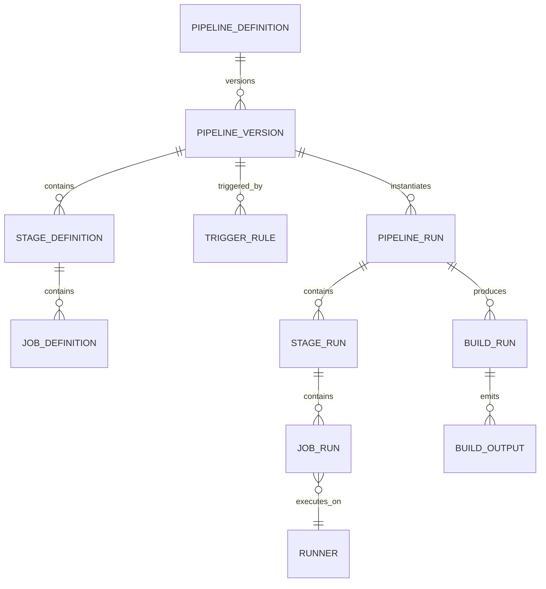
```mermaid
erDiagram
  PIPELINE_DEFINITION ||--o{ PIPELINE_VERSION : versions
  PIPELINE_VERSION ||--o{ STAGE_DEFINITION : contains
  STAGE_DEFINITION ||--o{ JOB_DEFINITION : contains
  PIPELINE_VERSION ||--o{ TRIGGER_RULE : triggered_by
  PIPELINE_VERSION ||--o{ PIPELINE_RUN : instantiates
  PIPELINE_RUN ||--o{ STAGE_RUN : contains
  STAGE_RUN ||--o{ JOB_RUN : contains
  JOB_RUN }o--|| RUNNER : executes_on
  PIPELINE_RUN ||--o{ BUILD_RUN : produces
  BUILD_RUN ||--o{ BUILD_OUTPUT : emits
```

| 对象 | 类型 | 关键信息 |
|---|---|---|
| `PipelineDefinition` | Aggregate Root | 名称、用途、负责人、适用仓库、生命周期 |
| `PipelineVersion` | Entity | 不可变定义、参数模式、工具链版本、内容摘要 |
| `StageDefinition` | Entity | 阶段顺序、进入条件、并发策略 |
| `JobDefinition` | Entity | 执行步骤、镜像/工具引用、资源要求、超时和重试策略 |
| `TriggerRule` | Entity | 事件、分支、标签、计划或人工触发条件 |
| `PipelineRun` | Aggregate Root | 运行号、定义版本、触发来源、提交、参数快照、状态 |
| `StageRun` | Entity | 阶段状态、起止时间、阻断原因 |
| `JobRun` | Entity | 作业状态、执行节点、退出码、日志引用 |
| `Runner` | Aggregate Root | 执行资源、能力标签、信任区、健康状态 |
| `BuildRun` | Aggregate Root | 输入提交、构建环境、工具链、输出和可复现信息 |
| `BuildOutput` | Entity | 输出名称、类型、内容摘要、暂存位置 |

### 9.3 流水线运行状态

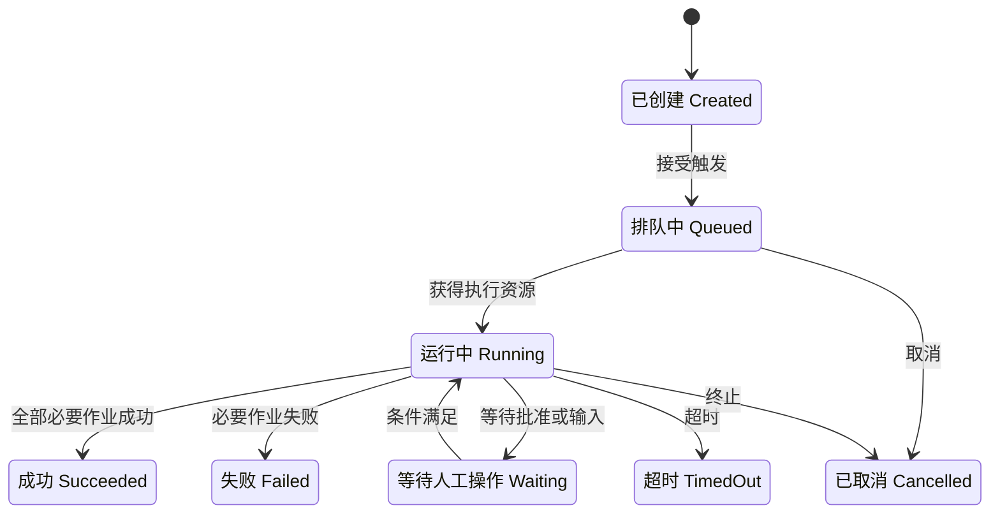
```mermaid
stateDiagram-v2
  state "已创建 Created" as Created
  state "排队中 Queued" as Queued
  state "运行中 Running" as Running
  state "等待人工操作 Waiting" as Waiting
  state "成功 Succeeded" as Succeeded
  state "失败 Failed" as Failed
  state "已取消 Cancelled" as Cancelled
  state "超时 TimedOut" as TimedOut

  [*] --> Created
  Created --> Queued: 接受触发
  Queued --> Running: 获得执行资源
  Running --> Waiting: 等待批准或输入
  Waiting --> Running: 条件满足
  Running --> Succeeded: 全部必要作业成功
  Running --> Failed: 必要作业失败
  Running --> TimedOut: 超时
  Queued --> Cancelled: 取消
  Running --> Cancelled: 终止
```

### 9.4 关键规则

- 每次运行必须固定引用一个 `PipelineVersion` 和参数快照。
- 重试作业是新的 `JobRun` 尝试，不能覆盖原失败事实。
- 流水线成功只表示定义中的必要作业成功，不自动等于质量、安全或发布批准。
- 运行日志与控制台展示可脱敏，但原始证据的保留由策略决定。
- 构建记录必须包含源码提交、工具链、依赖解析结果、环境标识和输出摘要。
- 不同信任区的 Runner 不得通过普通标签绕过资源隔离。
- 人工触发必须记录发起主体、原因和授权上下文。

### 9.5 领域事件

`PipelineTriggered`、`PipelineRunStarted`、`JobRunFailed`、`ManualInterventionRequested`、`PipelineRunCompleted`、`BuildCompleted`、`BuildOutputProduced`。

---

## 10. 子模型 BC-07：测试与质量

### 10.1 职责边界

管理测试计划和用例等验证资产、测试执行事实、质量规则、质量闸门评价及缺陷反馈。

### 10.2 对象模型

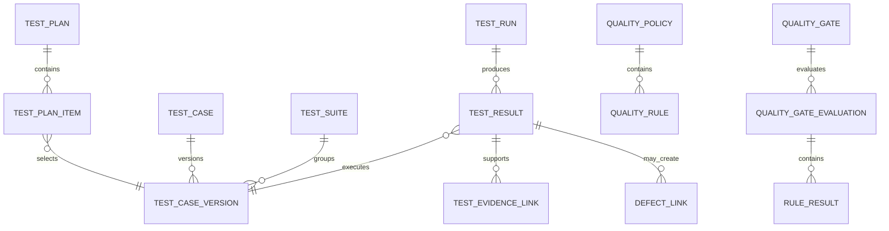
```mermaid
erDiagram
  TEST_PLAN ||--o{ TEST_PLAN_ITEM : contains
  TEST_PLAN_ITEM }o--|| TEST_CASE_VERSION : selects
  TEST_CASE ||--o{ TEST_CASE_VERSION : versions
  TEST_SUITE ||--o{ TEST_CASE_VERSION : groups
  TEST_RUN ||--o{ TEST_RESULT : produces
  TEST_RESULT }o--|| TEST_CASE_VERSION : executes
  TEST_RESULT ||--o{ TEST_EVIDENCE_LINK : supports
  QUALITY_POLICY ||--o{ QUALITY_RULE : contains
  QUALITY_GATE ||--o{ QUALITY_GATE_EVALUATION : evaluates
  QUALITY_GATE_EVALUATION ||--o{ RULE_RESULT : contains
  TEST_RESULT ||--o{ DEFECT_LINK : may_create
```

| 对象 | 类型 | 关键信息 |
|---|---|---|
| `TestPlan` | Aggregate Root | 验证范围、目标版本、负责人、进入/退出准则 |
| `TestCase` | Aggregate Root | 稳定标识、验证目的、需求追溯 |
| `TestCaseVersion` | Entity | 前置条件、步骤、数据要求、预期结果、自动化引用 |
| `TestSuite` | Aggregate Root | 测试用例集合、执行顺序、环境要求 |
| `TestRun` | Aggregate Root | 计划/套件版本、被测对象、环境、执行主体、状态 |
| `TestResult` | Entity | 实际结果、Pass/Fail/Blocked/Skipped、日志和证据 |
| `QualityPolicy` | Aggregate Root | 规则版本、适用范围、生效时间 |
| `QualityRule` | Entity | 指标、运算符、阈值、阻断级别、例外条件 |
| `QualityGate` | Aggregate Root | 闸门定义、应用点、所需输入 |
| `QualityGateEvaluation` | Aggregate Root | 输入快照、规则版本、规则结果、总结果、解释 |
| `RuleResult` | Entity | 单条规则的输入值、阈值、结果和解释 |

### 10.3 质量闸门评价

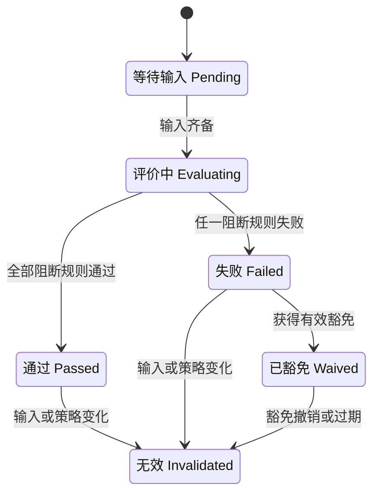
```mermaid
stateDiagram-v2
  state "等待输入 Pending" as Pending
  state "评价中 Evaluating" as Evaluating
  state "通过 Passed" as Passed
  state "失败 Failed" as Failed
  state "已豁免 Waived" as Waived
  state "无效 Invalidated" as Invalidated

  [*] --> Pending
  Pending --> Evaluating: 输入齐备
  Evaluating --> Passed: 全部阻断规则通过
  Evaluating --> Failed: 任一阻断规则失败
  Failed --> Waived: 获得有效豁免
  Passed --> Invalidated: 输入或策略变化
  Failed --> Invalidated: 输入或策略变化
  Waived --> Invalidated: 豁免撤销或过期
```

### 10.4 关键规则

- 测试用例版本在执行开始后不可改变，修改应形成新版本。
- 测试执行结果是事实，不能因缺陷关闭而改写为通过。
- 阻塞、跳过与失败是不同结果；跳过不能默认视为通过。
- 闸门评价必须固定输入集合和 `QualityPolicy` 版本。
- 重新评价产生新的 `QualityGateEvaluation`，旧结果保留。
- 自动化结果和人工测试结果都必须记录执行主体、环境和证据来源。
- 需求验证必须引用具体测试结果或批准的等价证据。

### 10.5 领域事件

`TestPlanApproved`、`TestRunStarted`、`TestResultRecorded`、`DefectRaisedFromTest`、`QualityGatePassed`、`QualityGateFailed`、`QualityEvaluationInvalidated`。

---

## 11. 子模型 BC-08：安全与合规

### 11.1 职责边界

管理安全要求、控制措施、合规配置、安全检查、发现项、漏洞、风险、处置、豁免及安全闸门。该上下文记录规则和证据引用，不保存秘密密钥或不应进入平台的敏感载荷。

### 11.2 对象模型

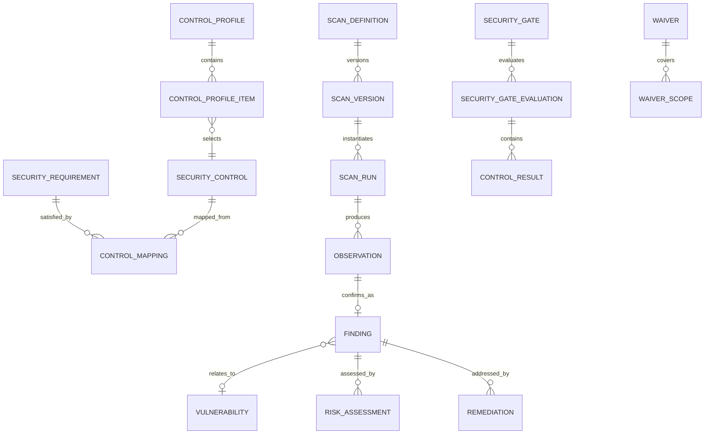
```mermaid
erDiagram
  SECURITY_REQUIREMENT ||--o{ CONTROL_MAPPING : satisfied_by
  SECURITY_CONTROL ||--o{ CONTROL_MAPPING : mapped_from
  CONTROL_PROFILE ||--o{ CONTROL_PROFILE_ITEM : contains
  CONTROL_PROFILE_ITEM }o--|| SECURITY_CONTROL : selects
  SCAN_DEFINITION ||--o{ SCAN_VERSION : versions
  SCAN_VERSION ||--o{ SCAN_RUN : instantiates
  SCAN_RUN ||--o{ OBSERVATION : produces
  OBSERVATION ||--o| FINDING : confirms_as
  FINDING }o--o| VULNERABILITY : relates_to
  FINDING ||--o{ RISK_ASSESSMENT : assessed_by
  FINDING ||--o{ REMEDIATION : addressed_by
  SECURITY_GATE ||--o{ SECURITY_GATE_EVALUATION : evaluates
  SECURITY_GATE_EVALUATION ||--o{ CONTROL_RESULT : contains
  WAIVER ||--o{ WAIVER_SCOPE : covers
```

| 对象 | 类型 | 关键信息 |
|---|---|---|
| `SecurityRequirement` | Aggregate Root | 来源、适用对象、验证方法、责任人、状态 |
| `SecurityControl` | Aggregate Root | 控制目标、控制方式、验证要求、证据要求 |
| `ControlProfile` | Aggregate Root | 某项目/产品适用的控制集合、裁剪理由、版本 |
| `ScanDefinition` | Aggregate Root | 检查类型、工具适配器、规则集、输入要求 |
| `ScanVersion` | Entity | 不可变规则和工具配置版本、内容摘要 |
| `ScanRun` | Aggregate Root | 被检查对象、工具版本、规则版本、环境、执行状态 |
| `Observation` | Entity | 工具原始观察结果、位置、规则、原始严重度 |
| `Finding` | Aggregate Root | 经归并确认的发现项、严重度、影响、处置状态 |
| `Vulnerability` | Aggregate Root | 可利用弱点标识、影响组件、漏洞信息来源 |
| `RiskAssessment` | Entity | 可能性、影响、风险等级、评估方法、评估人 |
| `Remediation` | Entity | 修复方案、责任人、目标日期、验证结果 |
| `SecurityGate` | Aggregate Root | 应用点、所需控制、规则、失败策略 |
| `SecurityGateEvaluation` | Aggregate Root | 输入和规则快照、控制结果、总体结果、解释 |
| `Waiver` | Aggregate Root | 豁免范围、理由、批准人、补偿控制、到期时间 |

### 11.3 概念边界

```text
Observation  工具报告的原始观察事实
Finding      经过去重、确认和归属后的待处理发现项
Vulnerability  可被利用的弱点
Risk         弱点在具体业务环境中的可能性与影响
SecurityGate  对一组事实执行规则评价的控制点
Waiver       在限定范围与期限内批准偏离要求的决定
```

### 11.4 发现项状态

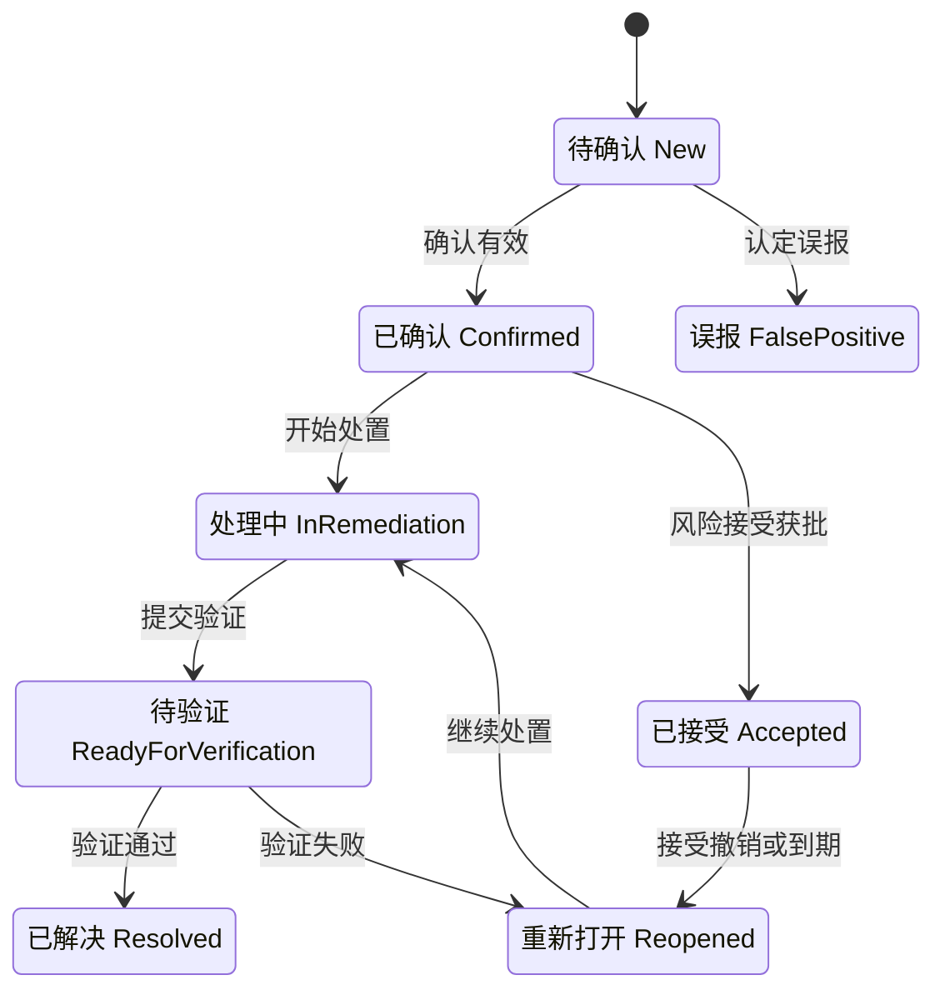
```mermaid
stateDiagram-v2
  state "待确认 New" as New
  state "已确认 Confirmed" as Confirmed
  state "处理中 InRemediation" as InRemediation
  state "待验证 ReadyForVerification" as ReadyForVerification
  state "已解决 Resolved" as Resolved
  state "已接受 Accepted" as Accepted
  state "误报 FalsePositive" as FalsePositive
  state "重新打开 Reopened" as Reopened

  [*] --> New
  New --> Confirmed: 确认有效
  New --> FalsePositive: 认定误报
  Confirmed --> InRemediation: 开始处置
  Confirmed --> Accepted: 风险接受获批
  InRemediation --> ReadyForVerification: 提交验证
  ReadyForVerification --> Resolved: 验证通过
  ReadyForVerification --> Reopened: 验证失败
  Reopened --> InRemediation: 继续处置
  Accepted --> Reopened: 接受撤销或到期
```

### 11.5 关键规则

- 安全扫描运行成功只表示工具正常完成，不表示被检查对象安全合格。
- 工具严重度、平台归一化严重度和业务风险等级分别保存。
- 误报、已修复和风险接受是不同结论，不能统一为“已关闭”。
- 豁免必须限定对象、规则、环境和有效期，并记录补偿控制。
- 安全闸门评价必须固定策略版本、输入事实和有效豁免集合。
- 输入事实、策略或豁免发生变化时，原评价必须标记为失效并重新评价。
- 发布使用的安全证据必须能追溯到具体制品内容摘要。

### 11.6 领域事件

`ScanCompleted`、`FindingConfirmed`、`VulnerabilityLinked`、`RiskAssessed`、`WaiverApproved`、`WaiverExpired`、`SecurityGatePassed`、`SecurityGateBlocked`。

---

## 12. 子模型 BC-09：制品与软件供应链

### 12.1 职责边界

管理由受控研发过程产生、可版本化、可校验、可晋级和可交付的软件制品，以及其依赖、SBOM、来源证明、签名和仓储位置。

### 12.2 对象模型

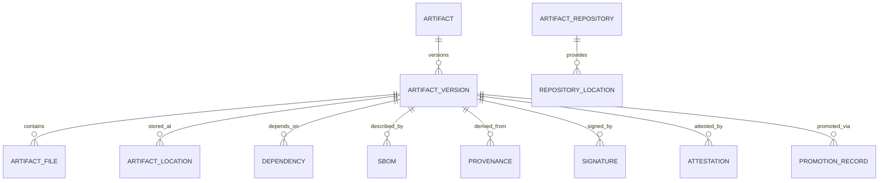
```mermaid
erDiagram
  ARTIFACT ||--o{ ARTIFACT_VERSION : versions
  ARTIFACT_VERSION ||--o{ ARTIFACT_FILE : contains
  ARTIFACT_REPOSITORY ||--o{ REPOSITORY_LOCATION : provides
  ARTIFACT_VERSION ||--o{ ARTIFACT_LOCATION : stored_at
  ARTIFACT_VERSION ||--o{ DEPENDENCY : depends_on
  ARTIFACT_VERSION ||--o{ SBOM : described_by
  ARTIFACT_VERSION ||--o{ PROVENANCE : derived_from
  ARTIFACT_VERSION ||--o{ SIGNATURE : signed_by
  ARTIFACT_VERSION ||--o{ ATTESTATION : attested_by
  ARTIFACT_VERSION ||--o{ PROMOTION_RECORD : promoted_via
```

| 对象 | 类型 | 关键信息 |
|---|---|---|
| `Artifact` | Aggregate Root | 制品名称、类型、坐标体系、负责人、版本策略 |
| `ArtifactVersion` | Aggregate Root | 业务版本、内容摘要、来源构建、生命周期、可用性 |
| `ArtifactFile` | Entity | 文件名、媒体类型、大小、内容摘要、用途 |
| `ArtifactRepository` | Aggregate Root | 仓库类型、信任区、保留策略、访问策略 |
| `ArtifactLocation` | Entity | 仓库、路径、存储状态、复制时间 |
| `Dependency` | Entity | 依赖坐标、版本、类型、作用域、来源 |
| `SBOM` | Entity | 格式、版本、内容摘要、生成工具、组件数量 |
| `Provenance` | Entity | 源码提交、构建运行、流水线版本、工具链和环境证明 |
| `Signature` | Entity | 签名算法引用、签名主体、证书引用、验证状态 |
| `Attestation` | Entity | 对特定声明的签署结果、声明类型、验证结果 |
| `PromotionRecord` | Entity | 来源仓、目标仓、发起人、规则评价、时间 |

### 12.3 制品状态模型

制品至少具有三条独立状态轴：

```text
生命周期：Candidate → Released → Deprecated → Retired
验证状态：Pending → Passed / Failed / Waived
可用状态：Available / Quarantined / Unavailable
```

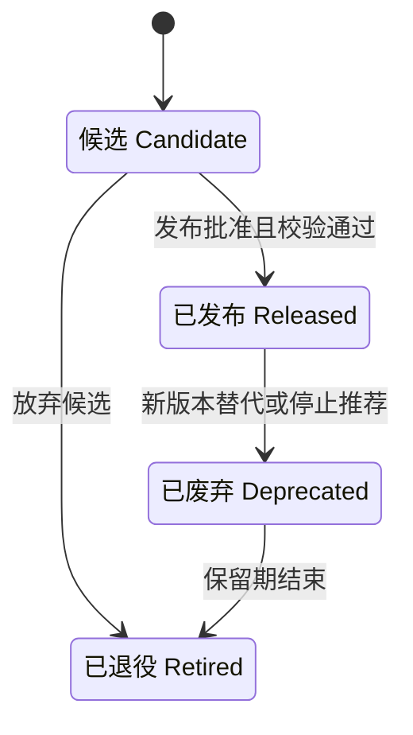
```mermaid
stateDiagram-v2
  state "候选 Candidate" as Candidate
  state "已发布 Released" as Released
  state "已废弃 Deprecated" as Deprecated
  state "已退役 Retired" as Retired

  [*] --> Candidate
  Candidate --> Released: 发布批准且校验通过
  Candidate --> Retired: 放弃候选
  Released --> Deprecated: 新版本替代或停止推荐
  Deprecated --> Retired: 保留期结束
```

### 12.4 关键规则

- `Artifact` 是制品族，`ArtifactVersion` 是可交付的具体不可变版本。
- 发布到受控制品库后的内容摘要不可变；同一坐标不得静默替换内容。
- 制品版本必须指向产生它的构建运行和源码提交。
- SBOM、来源证明、签名和扫描结果必须与制品内容摘要绑定。
- 晋级是跨信任区或仓库的受控动作，不等于复制文件。
- 隔离制品不可进入新发布，但历史发布引用仍应可审计。
- 删除动作受保留策略约束，优先使用退役和不可用状态保留历史事实。

### 12.5 领域事件

`ArtifactVersionPublished`、`ArtifactSigned`、`SBOMAttached`、`ArtifactVerificationFailed`、`ArtifactQuarantined`、`ArtifactPromoted`、`ArtifactDeprecated`。

---

## 13. 子模型 BC-10：工作流与审批

### 13.1 职责边界

提供跨子域可复用的人工流程编排，管理评审、审批、会签、委托、退回和授权决定。业务上下文拥有“为什么审批”，工作流上下文拥有“审批如何执行”。

### 13.2 对象模型

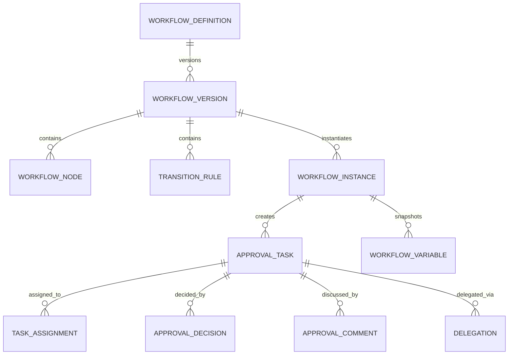
```mermaid
erDiagram
  WORKFLOW_DEFINITION ||--o{ WORKFLOW_VERSION : versions
  WORKFLOW_VERSION ||--o{ WORKFLOW_NODE : contains
  WORKFLOW_VERSION ||--o{ TRANSITION_RULE : contains
  WORKFLOW_VERSION ||--o{ WORKFLOW_INSTANCE : instantiates
  WORKFLOW_INSTANCE ||--o{ APPROVAL_TASK : creates
  APPROVAL_TASK ||--o{ TASK_ASSIGNMENT : assigned_to
  APPROVAL_TASK ||--o{ APPROVAL_DECISION : decided_by
  APPROVAL_TASK ||--o{ APPROVAL_COMMENT : discussed_by
  APPROVAL_TASK ||--o{ DELEGATION : delegated_via
  WORKFLOW_INSTANCE ||--o{ WORKFLOW_VARIABLE : snapshots
```

| 对象 | 类型 | 关键信息 |
|---|---|---|
| `WorkflowDefinition` | Aggregate Root | 名称、用途、适用业务类型、负责人 |
| `WorkflowVersion` | Entity | 不可变流程图、节点、规则、内容摘要 |
| `WorkflowNode` | Entity | 开始、人工任务、自动任务、网关、结束节点 |
| `TransitionRule` | Entity | 来源节点、目标节点、条件、优先级 |
| `WorkflowInstance` | Aggregate Root | 业务对象、定义版本、发起人、变量快照、状态 |
| `ApprovalTask` | Aggregate Root | 审批事项、候选人规则、截止时间、任务状态 |
| `TaskAssignment` | Entity | 分配主体、分配依据、接收时间 |
| `ApprovalDecision` | Entity | Approve/Reject/Return/Abstain、意见、签署时间 |
| `ApprovalComment` | Entity | 讨论内容、作者、可见范围、时间 |
| `Delegation` | Entity | 委托人、受托人、范围、理由、有效期 |

### 13.3 审批任务状态

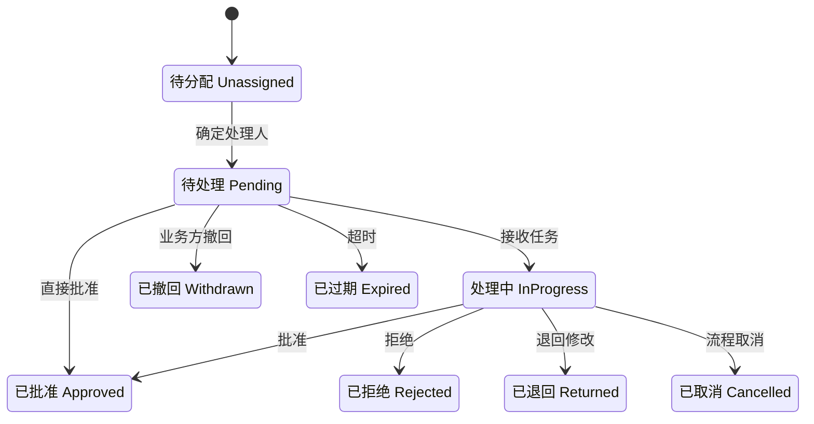
```mermaid
stateDiagram-v2
  state "待分配 Unassigned" as Unassigned
  state "待处理 Pending" as Pending
  state "处理中 InProgress" as InProgress
  state "已批准 Approved" as Approved
  state "已拒绝 Rejected" as Rejected
  state "已退回 Returned" as Returned
  state "已撤回 Withdrawn" as Withdrawn
  state "已过期 Expired" as Expired
  state "已取消 Cancelled" as Cancelled

  [*] --> Unassigned
  Unassigned --> Pending: 确定处理人
  Pending --> InProgress: 接收任务
  Pending --> Approved: 直接批准
  InProgress --> Approved: 批准
  InProgress --> Rejected: 拒绝
  InProgress --> Returned: 退回修改
  Pending --> Expired: 超时
  Pending --> Withdrawn: 业务方撤回
  InProgress --> Cancelled: 流程取消
```

### 13.4 关键规则

- 评审意见和审批决定是不同对象；评审可以提供建议，审批产生授权效果。
- 流程实例启动后必须固定引用 `WorkflowVersion`。
- 审批人集合由角色、组织、项目、密级和职责分离规则共同决定。
- 委托不得扩大原审批人的权限范围，且必须保留原责任链。
- 会签、或签、顺序签和否决权必须显式建模。
- 已生效决定不可覆盖；撤销必须形成新的撤销决定和理由。
- 审批任务完成不等于业务对象必然成功，业务上下文应验证决定是否仍然有效。

### 13.5 领域事件

`WorkflowStarted`、`ApprovalTaskAssigned`、`ApprovalRequested`、`ApprovalGranted`、`ApprovalRejected`、`ApprovalReturned`、`ApprovalExpired`、`WorkflowCompleted`。

---

## 14. 子模型 BC-11：发布与变更

### 14.1 职责边界

将经过验证的制品、配置、文档和变更内容组织为候选发布，执行准入检查与发布审批，形成可交付的受控发布。

### 14.2 对象模型

```mermaid
erDiagram
  RELEASE ||--o{ RELEASE_CANDIDATE : has
  RELEASE_CANDIDATE ||--o{ RELEASE_ITEM : contains
  RELEASE_ITEM }o--|| ARTIFACT_VERSION_REF : selects
  RELEASE_CANDIDATE ||--o{ CHANGE_SUMMARY : documents
  RELEASE_CANDIDATE ||--o{ GATE_RESULT_REF : requires
  RELEASE_CANDIDATE ||--o{ RELEASE_APPROVAL_REF : approved_by
  RELEASE ||--o{ RELEASE_NOTE : explains
  RELEASE ||--o{ ROLLBACK_PLAN : protected_by
  RELEASE ||--o{ RELEASE_BASELINE : freezes
```

| 对象 | 类型 | 关键信息 |
|---|---|---|
| `Release` | Aggregate Root | 发布标识、产品版本、类型、目标范围、生命周期 |
| `ReleaseCandidate` | Aggregate Root | 候选号、内容集合、验证快照、准备状态 |
| `ReleaseItem` | Entity | 制品版本、配置版本、文档版本、用途、安装顺序 |
| `ChangeSummary` | Entity | 需求、缺陷、变更请求、兼容性和风险摘要 |
| `GateResultRef` | Value Object | 质量/安全/合规闸门评价引用及有效性 |
| `ReleaseApprovalRef` | Value Object | 审批流程、决定、决定主体和时间 |
| `ReleaseNote` | Entity | 新增、修复、已知问题、升级说明、适用范围 |
| `RollbackPlan` | Entity | 触发条件、回滚版本、步骤、验证方式、责任人 |
| `ReleaseBaseline` | Entity | 发布时冻结的制品、配置、证据和审批集合 |

### 14.3 发布状态

```mermaid
stateDiagram-v2
  state "草稿 Draft" as Draft
  state "候选准备中 Preparing" as Preparing
  state "待验证 Verifying" as Verifying
  state "待批准 PendingApproval" as PendingApproval
  state "已批准 Approved" as Approved
  state "已发布 Released" as Released
  state "已暂停 Suspended" as Suspended
  state "已撤销 Revoked" as Revoked
  state "已归档 Archived" as Archived

  [*] --> Draft
  Draft --> Preparing: 创建候选
  Preparing --> Verifying: 内容冻结
  Verifying --> PendingApproval: 闸门满足
  PendingApproval --> Approved: 审批通过
  PendingApproval --> Preparing: 退回修改
  Approved --> Released: 正式发布
  Released --> Suspended: 暂停分发
  Released --> Revoked: 撤销发布
  Suspended --> Released: 恢复
  Released --> Archived: 停止维护
  Revoked --> Archived: 完成处置
```

### 14.4 关键规则

- 发布不是部署；发布表示一个受控版本被批准可供指定范围使用。
- 发布候选内容冻结后，任何制品或配置变化都应产生新候选号。
- 发布批准必须基于仍有效的闸门评价和证据快照。
- 已批准候选若输入、策略或关键风险变化，必须使批准失效或重新确认。
- 发布基线必须能重建发布时的内容、规则、证据和决定。
- 撤销发布不删除历史信息，并应触发受影响部署的分析。
- 每个正式发布必须具有回滚或不可回滚说明。

### 14.5 领域事件

`ReleaseCandidateCreated`、`ReleaseContentFrozen`、`ReleaseReadyForApproval`、`ReleaseApproved`、`ReleasePublished`、`ReleaseSuspended`、`ReleaseRevoked`。

---

## 15. 子模型 BC-12：环境与部署

### 15.1 职责边界

管理逻辑环境、部署目标、运行配置引用、部署计划、执行、晋级、验证和回滚。平台只保存秘密引用和使用记录，不保存不应由平台持有的秘密正文。

### 15.2 对象模型

```mermaid
erDiagram
  ENVIRONMENT ||--o{ DEPLOYMENT_TARGET : contains
  ENVIRONMENT ||--o{ ENVIRONMENT_POLICY : governed_by
  DEPLOYMENT_TARGET ||--o{ RUNTIME_COMPONENT : hosts
  DEPLOYMENT_PLAN ||--o{ DEPLOYMENT_STEP : contains
  DEPLOYMENT_PLAN ||--o{ DEPLOYMENT : instantiates
  DEPLOYMENT }o--|| RELEASE_REF : deploys
  DEPLOYMENT ||--o{ STEP_EXECUTION : executes
  DEPLOYMENT ||--o{ DEPLOYMENT_VERIFICATION : verifies
  DEPLOYMENT ||--o{ CONFIGURATION_BINDING : configures
  CONFIGURATION_BINDING }o--|| SECRET_REFERENCE : references
  DEPLOYMENT ||--o| ROLLBACK_EXECUTION : may_trigger
  PROMOTION ||--|| DEPLOYMENT : creates
```

| 对象 | 类型 | 关键信息 |
|---|---|---|
| `Environment` | Aggregate Root | 环境类型、信任区、用途、责任人、状态 |
| `DeploymentTarget` | Entity | 集群/主机/设备等目标引用、能力、健康状态 |
| `EnvironmentPolicy` | Entity | 允许的来源、发布级别、变更窗口、审批要求 |
| `RuntimeComponent` | Entity | 已安装组件、版本、实例标识、期望/实际状态 |
| `DeploymentPlan` | Aggregate Root | 部署策略、步骤、批次、超时、回滚和验证方案 |
| `DeploymentStep` | Entity | 操作类型、目标选择器、依赖、失败处理 |
| `Deployment` | Aggregate Root | 发布、环境、计划版本、发起人、执行状态 |
| `StepExecution` | Entity | 某步骤某次尝试、状态、日志和输出引用 |
| `DeploymentVerification` | Entity | 健康检查、冒烟测试、人工确认及结果 |
| `ConfigurationBinding` | Entity | 配置项版本与环境/组件的绑定 |
| `SecretReference` | Reference | 秘密管理系统、秘密标识、版本引用，不含秘密值 |
| `Promotion` | Aggregate Root | 来源环境、目标环境、发布、准入评价、决定 |
| `RollbackExecution` | Entity | 触发原因、目标版本、步骤、结果 |

### 15.3 部署状态

```mermaid
stateDiagram-v2
  state "已计划 Planned" as Planned
  state "待批准 PendingApproval" as PendingApproval
  state "排队中 Queued" as Queued
  state "部署中 Deploying" as Deploying
  state "验证中 Verifying" as Verifying
  state "成功 Succeeded" as Succeeded
  state "失败 Failed" as Failed
  state "回滚中 RollingBack" as RollingBack
  state "已回滚 RolledBack" as RolledBack
  state "已取消 Cancelled" as Cancelled

  [*] --> Planned
  Planned --> PendingApproval: 需要审批
  Planned --> Queued: 无需审批且准入通过
  PendingApproval --> Queued: 审批通过
  PendingApproval --> Cancelled: 拒绝或撤回
  Queued --> Deploying: 获得执行窗口
  Deploying --> Verifying: 步骤完成
  Verifying --> Succeeded: 验证通过
  Deploying --> Failed: 执行失败
  Verifying --> Failed: 验证失败
  Failed --> RollingBack: 触发回滚
  RollingBack --> RolledBack: 回滚成功
```

### 15.4 关键规则

- 部署必须固定引用正式发布或经批准的例外候选。
- 生产性或高安全等级环境的部署必须满足环境策略和职责分离要求。
- 配置绑定必须记录版本；“使用最新配置”不适用于受控部署。
- 回滚是新的受控执行，不能删除失败部署记录。
- 晋级是发布在环境之间的受控推广，不是直接复用上一环境的运行实例。
- 部署成功至少要求所有必要步骤完成且部署验证通过。
- 环境中实际版本与期望版本不一致时形成配置漂移事实。

### 15.5 领域事件

`DeploymentRequested`、`DeploymentApproved`、`DeploymentStarted`、`DeploymentVerificationFailed`、`DeploymentSucceeded`、`RollbackStarted`、`RollbackCompleted`、`ConfigurationDriftDetected`。

---

## 16. 子模型 BC-13：运行反馈

### 16.1 职责边界

收集已部署软件的运行状态、告警和事件，将运行问题反馈为缺陷、风险、变更或需求，形成 DevOps 闭环。该上下文不是完整的监控平台或 ITSM 系统，可通过外部引用接入。

### 16.2 对象模型

```mermaid
erDiagram
  SERVICE ||--o{ SERVICE_INSTANCE : instantiates
  SERVICE_INSTANCE }o--|| DEPLOYMENT_REF : created_by
  SERVICE_INSTANCE ||--o{ HEALTH_OBSERVATION : observed_by
  ALERT_RULE ||--o{ ALERT : triggers
  ALERT }o--o| SERVICE_INSTANCE : affects
  INCIDENT ||--o{ INCIDENT_IMPACT : describes
  INCIDENT ||--o{ INCIDENT_TIMELINE_ENTRY : records
  INCIDENT ||--o{ REMEDIATION_ACTION : handled_by
  INCIDENT ||--o| PROBLEM : may_reveal
  PROBLEM ||--o{ ROOT_CAUSE : analyzed_by
  INCIDENT ||--o{ DEVELOPMENT_FEEDBACK : feeds_back
```

| 对象 | 类型 | 关键信息 |
|---|---|---|
| `Service` | Aggregate Root | 服务名称、产品组件、负责人、关键度 |
| `ServiceInstance` | Entity | 环境、部署、制品版本、运行实例标识 |
| `HealthObservation` | Entity | 指标/检查、时间、值、健康结论、来源 |
| `AlertRule` | Aggregate Root | 条件、窗口、抑制规则、通知策略 |
| `Alert` | Aggregate Root | 触发值、影响对象、状态、确认人 |
| `Incident` | Aggregate Root | 事件等级、影响范围、负责人、状态、时间线 |
| `IncidentImpact` | Entity | 受影响服务、用户范围、功能和时间 |
| `RemediationAction` | Entity | 止损、恢复或修复动作及结果 |
| `Problem` | Aggregate Root | 重复或重大事件背后的根本问题 |
| `RootCause` | Entity | 原因、证据、分析方法、确认状态 |
| `DevelopmentFeedback` | Entity | 转化后的缺陷、风险、变更或需求引用 |

### 16.3 事件状态

```mermaid
stateDiagram-v2
  state "已发现 Detected" as Detected
  state "已确认 Acknowledged" as Acknowledged
  state "处理中 Responding" as Responding
  state "已缓解 Mitigated" as Mitigated
  state "已恢复 Recovered" as Recovered
  state "已关闭 Closed" as Closed

  [*] --> Detected
  Detected --> Acknowledged: 接手
  Acknowledged --> Responding: 开始处置
  Responding --> Mitigated: 影响受控
  Mitigated --> Recovered: 服务恢复
  Recovered --> Closed: 复盘与反馈完成
  Mitigated --> Responding: 问题复发
```

### 16.4 关键规则

- 告警是规则触发信号，事件是需要协调处置的业务影响，两者不能等同。
- 事件关闭前应记录影响、处置、恢复证据和必要的研发反馈。
- 根因分析结论必须有证据，并允许“尚未确定”，不能强制选择虚假根因。
- 运行实例必须能够追溯到部署、发布和制品版本。
- 重大事件形成的缺陷或变更不能脱离原事件上下文。

### 16.5 领域事件

`AlertTriggered`、`IncidentDeclared`、`IncidentMitigated`、`ServiceRecovered`、`RootCauseConfirmed`、`DevelopmentFeedbackCreated`、`IncidentClosed`。

---

## 17. 子模型 BC-14：证据与审计

### 17.1 职责边界

统一管理可以支持验证、闸门、审批、发布和审计结论的证据引用，以及不可抵赖的审计事件、证据包和保留策略。

### 17.2 对象模型

```mermaid
erDiagram
  EVIDENCE ||--o{ EVIDENCE_VERSION : versions
  EVIDENCE_VERSION ||--o{ EVIDENCE_SUBJECT : proves_about
  EVIDENCE_VERSION ||--o{ EVIDENCE_LOCATION : stored_at
  EVIDENCE_BUNDLE ||--o{ BUNDLE_ITEM : contains
  BUNDLE_ITEM }o--|| EVIDENCE_VERSION : selects
  AUDIT_TRAIL ||--o{ AUDIT_EVENT : records
  AUDIT_EVENT ||--o{ EVENT_SUBJECT : affects
  RETENTION_POLICY ||--o{ RETENTION_RULE : contains
  EVIDENCE_VERSION }o--|| RETENTION_POLICY : retained_by
  AUDIT_EXPORT ||--o{ EXPORT_ITEM : contains
```

| 对象 | 类型 | 关键信息 |
|---|---|---|
| `Evidence` | Aggregate Root | 证据类型、来源、责任主体、可信级别 |
| `EvidenceVersion` | Entity | 内容摘要、生成时间、采集方式、签名、有效期 |
| `EvidenceSubject` | Entity | 证据支持的对象、声明、时间范围和关系类型 |
| `EvidenceLocation` | Entity | 存储系统、位置引用、可用性、访问约束 |
| `EvidenceBundle` | Aggregate Root | 审批/发布/审计用途、冻结时间、内容摘要 |
| `BundleItem` | Entity | 证据版本、用途、必要性、验证结果 |
| `AuditTrail` | Aggregate Root | 业务链路或对象的审计事件集合 |
| `AuditEvent` | Entity | 主体、动作、对象、前后状态摘要、时间、来源、结果 |
| `RetentionPolicy` | Aggregate Root | 对象类型、保留期、冻结条件、处置方式 |
| `AuditExport` | Aggregate Root | 导出用途、申请人、批准记录、范围、内容摘要 |

### 17.3 证据可信链

```mermaid
flowchart LR
  S[证据来源] --> C[采集]
  C --> H[内容摘要]
  H --> SG[签名或证明]
  SG --> ST[受控存储]
  ST --> B[证据包冻结]
  B --> V[验证]
  V --> D[闸门或审批决定]
  D --> A[审计追溯]
```

### 17.4 关键规则

- 证据正文与证据元数据分离；平台可只保存受控外部位置和内容摘要。
- 被证据包、审批或发布引用的证据版本不可原地修改。
- 自动生成证据必须记录工具、规则、版本、运行和输入对象。
- 人工证据必须记录提交人、证明范围和审核状态。
- 审计事件采用追加模式；更正通过新的更正事件表达。
- 导出审计数据必须受访问控制、审批、范围限制和导出审计约束。
- 保留期到期不必然允许删除；法律保全、调查或基线引用可继续冻结。

### 17.5 领域事件

`EvidenceCaptured`、`EvidenceVerified`、`EvidenceInvalidated`、`EvidenceBundleSealed`、`AuditEventAppended`、`RetentionHoldApplied`、`AuditExportCompleted`。

---

## 18. 子模型 BC-15：度量与分析

### 18.1 职责边界

定义可解释、可追溯的指标，采集不可歧义的测量值，并基于统一维度形成研发效能、质量、安全和合规分析。该上下文不拥有业务事实，只消费其他上下文发布的事件和快照。

### 18.2 对象模型

```mermaid
erDiagram
  METRIC_DEFINITION ||--o{ METRIC_VERSION : versions
  METRIC_VERSION ||--o{ DIMENSION_DEFINITION : sliced_by
  METRIC_VERSION ||--o{ MEASUREMENT : produces
  MEASUREMENT ||--o{ DIMENSION_VALUE : classified_by
  MEASUREMENT ||--o{ SOURCE_FACT_REF : derived_from
  DASHBOARD ||--o{ DASHBOARD_WIDGET : contains
  DASHBOARD_WIDGET }o--|| METRIC_VERSION : visualizes
  TARGET ||--o{ TARGET_PERIOD : plans
  METRIC_VERSION ||--o{ QUALITY_CHECK : validated_by
```

| 对象 | 类型 | 关键信息 |
|---|---|---|
| `MetricDefinition` | Aggregate Root | 指标名称、业务问题、负责人、生命周期 |
| `MetricVersion` | Entity | 公式、单位、时间窗、口径、数据源、适用范围 |
| `DimensionDefinition` | Entity | 项目、产品、组织、环境、密级等分析维度 |
| `Measurement` | Aggregate Root | 指标版本、周期、值、计算时间、质量状态 |
| `DimensionValue` | Entity | 维度和取值，遵守访问范围 |
| `SourceFactRef` | Value Object | 来源事件、快照和查询版本引用 |
| `Dashboard` | Aggregate Root | 使用目的、读者、访问范围、版本 |
| `DashboardWidget` | Entity | 指标、过滤条件、展示方式、解释文本 |
| `Target` | Aggregate Root | 目标值、基线值、适用范围、批准依据 |
| `QualityCheck` | Entity | 完整性、及时性、重复性和异常检查结果 |

### 18.3 关键规则

- 指标名称相同但公式或时间窗不同，必须形成不同指标版本。
- 每个指标必须说明“回答什么问题”和“不能说明什么”。
- 测量值必须可追溯到来源事实和计算口径。
- 访问受限对象聚合后仍需执行最小样本量和权限规则，避免推断敏感信息。
- 仪表盘不能修改源业务数据，也不能把预测值伪装为事实值。
- 目标值与实际测量值分离；目标变更不能改写历史实际值。

### 18.4 领域事件

`MetricDefinitionPublished`、`MeasurementCalculated`、`MeasurementQualityFailed`、`TargetApproved`、`DashboardPublished`。

---

## 19. 跨子域关键流程

### 19.1 从需求到部署

```mermaid
sequenceDiagram
  participant Req as 需求与工作项
  participant Scm as 配置与源码
  participant Pip as 流水线与构建
  participant Art as 制品供应链
  participant Tq as 测试与质量
  participant Sec as 安全与合规
  participant Rel as 发布与变更
  participant Wf as 工作流与审批
  participant Dep as 环境与部署
  participant Ev as 证据与审计

  Req->>Scm: 提供已批准需求版本和实现关系
  Scm->>Pip: 合并提交触发流水线
  Pip->>Art: 发布带来源证明的候选制品
  Pip->>Ev: 固化构建记录和日志证据
  Art->>Tq: 提供被测制品版本
  Art->>Sec: 提供待检查制品、SBOM和来源证明
  Tq->>Rel: 提供质量闸门评价
  Sec->>Rel: 提供安全闸门评价
  Rel->>Wf: 请求发布审批
  Wf-->>Rel: 返回授权决定
  Rel->>Dep: 发布已批准版本
  Dep->>Ev: 固化部署和验证证据
  Dep-->>Req: 建立需求到部署的最终追溯
```

### 19.2 闸门、豁免与审批

```mermaid
sequenceDiagram
  participant Obj as 被评价对象
  participant Gate as 闸门评价
  participant Policy as 策略与控制
  participant Waiver as 豁免
  participant Evidence as 证据
  participant Approval as 审批

  Obj->>Gate: 提交对象版本及内容摘要
  Gate->>Policy: 固定策略版本
  Gate->>Evidence: 获取有效输入事实
  Gate->>Waiver: 获取适用且未过期的豁免
  Gate->>Gate: 计算逐规则结果与总体结论
  alt 通过
    Gate-->>Obj: Passed
  else 失败但允许申请豁免
    Gate-->>Approval: 发起豁免审批
    Approval-->>Waiver: 形成限定范围和期限的决定
    Waiver-->>Gate: 触发重新评价
  else 阻断
    Gate-->>Obj: Failed / Blocked
  end
```

### 19.3 运行问题反馈到研发

```mermaid
sequenceDiagram
  participant Ops as 运行反馈
  participant Dep as 环境与部署
  participant Rel as 发布与变更
  participant Art as 制品供应链
  participant Req as 需求与工作项
  participant Audit as 证据与审计

  Ops->>Dep: 根据服务实例定位部署
  Dep->>Rel: 追溯发布
  Rel->>Art: 追溯制品版本
  Ops->>Req: 创建缺陷、风险或变更请求
  Req->>Req: 影响分析并建立追溯关系
  Ops->>Audit: 固化事件时间线和处置证据
  Req-->>Ops: 返回修复版本和验证结果
```

---

## 20. 聚合边界与一致性规则

### 20.1 强一致性边界

下列规则应在单个聚合事务中完成：

- `Requirement` 当前版本指针与新 `RequirementVersion` 的创建；
- `PipelineRun` 与其运行状态迁移；
- `ArtifactVersion` 发布坐标与内容摘要唯一性；
- `ApprovalTask` 最终决定与任务完成状态；
- `ReleaseCandidate` 内容冻结与候选号生成；
- `Deployment` 当前执行状态与步骤尝试登记；
- `EvidenceBundle` 封存状态与内容摘要。

### 20.2 最终一致性关系

下列跨上下文关系通过领域事件和幂等订阅保持最终一致：

- 提交与需求实现关系；
- 构建运行与制品版本；
- 测试/扫描结果与闸门评价；
- 闸门评价与发布候选准入状态；
- 发布与部署；
- 运行事件与缺陷/变更反馈；
- 所有业务事件与审计、度量投影。

### 20.3 跨上下文引用规则

- 只引用其他上下文公开的稳定标识、版本和必要快照。
- 不跨上下文直接修改对方实体。
- 历史决定使用当时快照，不因主数据更新自动改变含义。
- 外部工具的数据通过防腐层转换为统一语言，避免工具术语污染核心模型。

---

## 21. 领域事件信封

所有跨上下文事件建议使用统一信封：

```yaml
eventId: unique-event-id
eventType: ArtifactVersionPublished
eventVersion: 1
occurredAt: 2026-07-13T10:00:00+08:00
recordedAt: 2026-07-13T02:00:01Z
producer: artifact-context
aggregateType: ArtifactVersion
aggregateId: artifact-version-id
aggregateVersion: 12
organizationScopeId: organization-scope-id
projectId: project-id
securityLabelId: security-label-id
actor:
  principalId: principal-id
  principalType: User
correlationId: end-to-end-operation-id
causationId: source-event-id
payload:
  artifactId: artifact-id
  businessVersion: 1.4.2
  digest:
    algorithm: SHA-256
    value: content-digest
```

规则：

- 事件类型使用已经发生的过去式事实，不使用命令式名称。
- `eventId` 全局唯一，消费者必须支持幂等。
- 事件载荷只包含订阅者所需信息，敏感正文通过受控引用获取。
- 事件版本演进保持向后兼容；破坏性变化发布新的事件版本。
- `correlationId` 贯穿需求、构建、发布、部署和审计链路。

---

## 22. 权限、密级与数据隔离的统一附着模型

### 22.1 安全标签

```text
SecurityLabel
├── classificationLevelRef    密级等级引用
├── compartments[]            分区、项目或知悉域
├── releasability[]           允许传播范围
├── handlingInstructionRefs[] 处理规则引用
├── originatorOrganizationId  原始定密/标记组织引用
├── effectiveAt
└── expiresAt / reviewAt
```

### 22.2 访问约束

- 用户界面、API、导出、搜索索引和度量聚合使用同一套访问决策语义。
- 列表数量、自动补全和错误消息不得泄露无权知悉对象是否存在。
- 对象关系的两端权限不同，不能因为有权查看一端而暴露另一端详情。
- 安全标签降低、传播范围扩大或导出属于高风险操作，应触发审批和审计。
- 平台通用模型只保存密级和处理规则的引用；具体枚举及判定规则由单位配置。

---

## 23. 术语词典与设计系统映射

每个核心领域概念都应在术语词典中建立 `Concept`，并逐步连接产品、设计和代码：

| 层级 | 示例：制品 |
|---|---|
| 领域概念 | `MDO-ARTIFACT` |
| 中文首选名 | 制品 |
| 英文首选名 | Artifact |
| 聚合 | `Artifact` / `ArtifactVersion` |
| 对象视图 | Artifact List、Artifact Detail、Artifact Compare |
| Figma | `Domain Objects / Artifact` |
| Vue 组件 | `ArtifactObject`、`ArtifactStatus`、`ArtifactEvidence` |
| API | `/artifacts`、`ArtifactDTO` |
| 数据实体 | `artifact`、`artifact_version` |
| 领域事件 | `ArtifactVersionPublished` |

首批建议建立的核心概念不是五个孤立术语，而是五个术语包：

1. **Requirement**：需求、需求版本、验收准则、追溯关系、变更请求、验证。
2. **Pipeline**：流水线定义、流水线版本、流水线运行、阶段、作业、触发器、Runner。
3. **Artifact**：制品、制品版本、制品库、摘要、签名、SBOM、来源证明、晋级。
4. **Security Gate**：安全要求、控制、扫描、发现项、漏洞、风险、闸门评价、豁免、证据。
5. **Approval**：工作流、审批任务、处理人、审批决定、会签、委托、退回、撤销。

---

## 24. 分阶段落地建议

### 阶段 1：统一语言和数字主线

- 建立 BC-01 术语与语义治理；
- 固化 Requirement、Pipeline、Artifact、Security Gate、Approval 五个术语包；
- 统一稳定标识、版本、状态维度和跨域引用；
- 打通需求 → 提交 → 构建 → 制品 → 发布 → 部署主链路。

### 阶段 2：质量、安全和发布治理

- 建立测试、扫描、闸门、豁免和证据模型；
- 建立发布候选、发布基线和回滚计划；
- 形成定义版本、运行实例、评价结果和人工决定的明确分层。

### 阶段 3：行业治理能力

- 接入组织权限、密级标签、职责分离和单位级审批策略；
- 完善配置项、基线、签名、SBOM、来源证明和审计导出；
- 对关键业务对象实施字段级显示和导出控制。

### 阶段 4：运行反馈与度量

- 建立部署到运行实例的追溯；
- 将事件反馈为缺陷、风险和变更；
- 建立可解释的研发效能、质量、安全和合规指标。

---

## 25. 模型完整性检查清单

### 25.1 概念完整性

- [ ] 每个核心对象具有唯一概念标识和统一中英文名。
- [ ] 定义、版本、运行、评价和决定没有混为同一对象。
- [ ] 发布与部署、扫描与闸门、评审与审批、版本与基线已经消歧。
- [ ] 生命周期、执行、验证、决定、可用性、严重度和密级状态分离。

### 25.2 追溯完整性

- [ ] 部署可追溯到发布和制品版本。
- [ ] 制品可追溯到构建、流水线版本、提交和依赖。
- [ ] 提交可追溯到需求、缺陷或变更请求。
- [ ] 发布可追溯到测试、安全、审批和证据快照。
- [ ] 运行事件可反馈到研发工作项并追踪修复版本。

### 25.3 治理完整性

- [ ] 关键对象具有组织范围和安全标签。
- [ ] 角色授权有作用域、依据和有效期。
- [ ] 高风险动作具有职责分离、审批和审计。
- [ ] 证据和审计记录采用不可静默覆盖的版本/追加模型。
- [ ] 指标能够解释来源、公式、时间窗和访问范围。

### 25.4 工程完整性

- [ ] 每个聚合根明确拥有者和事务边界。
- [ ] 跨上下文通过稳定标识、事件和快照交互。
- [ ] 外部工具通过防腐层映射统一语言。
- [ ] 领域事件具有版本、幂等标识、关联链路和密级标签。
- [ ] 术语、Figma、组件、API、数据实体和事件可以相互映射。

---

## 26. 参考依据

- [全栈设计系统解析](./全栈设计系统解析.md)
- [全栈设计系统实施方案](./全栈设计系统实施方案.md)
- [GB/T 11457-2006《信息技术 软件工程术语》](https://openstd.samr.gov.cn/bzgk/std/newGbInfo?hcno=07E3E9867D23EA5A74EB525A44622E86)
- [GB/T 8566-2022《系统与软件工程 软件生存周期过程》](https://openstd.samr.gov.cn/bzgk/std/newGbInfo?hcno=1196DB510493E4E57EC6796598E75CDA)
- [ISO/IEC/IEEE 24765:2017 Systems and software engineering — Vocabulary](https://www.iso.org/standard/71952.html)
- [NIST SP 800-218 Secure Software Development Framework](https://csrc.nist.gov/pubs/sp/800/218/final)

---

## 附录 A：第一批核心聚合清单

| 优先级 | 聚合根 | 所属上下文 | 首批建设理由 |
|---|---|---|---|
| P0 | `Concept` | 术语与语义治理 | 统一所有团队语言和映射 |
| P0 | `Project` | 型号、产品与项目 | 提供业务归属和隔离边界 |
| P0 | `Requirement` | 需求与工作项 | 数字主线起点 |
| P0 | `Repository` | 配置与源码 | 连接实现事实 |
| P0 | `PipelineDefinition` | 流水线与构建 | 自动化定义资产 |
| P0 | `PipelineRun` | 流水线与构建 | 自动化执行事实 |
| P0 | `BuildRun` | 流水线与构建 | 连接源码和制品 |
| P0 | `ArtifactVersion` | 制品与供应链 | 交付链核心不可变对象 |
| P0 | `SecurityGateEvaluation` | 安全与合规 | 安全准入决定依据 |
| P0 | `WorkflowInstance` | 工作流与审批 | 统一审批过程 |
| P0 | `ApprovalTask` | 工作流与审批 | 人工授权的最小工作单元 |
| P0 | `Release` | 发布与变更 | 受控交付边界 |
| P0 | `Deployment` | 环境与部署 | 数字主线交付落点 |
| P0 | `EvidenceBundle` | 证据与审计 | 固化发布和审批依据 |
| P1 | `TestRun` | 测试与质量 | 验证事实 |
| P1 | `QualityGateEvaluation` | 测试与质量 | 质量准入依据 |
| P1 | `Finding` | 安全与合规 | 安全问题闭环 |
| P1 | `Baseline` | 配置与源码 | 军工配置管理关键对象 |
| P1 | `SecurityLabel` | 身份与访问控制 | 密级和知悉范围附着 |
| P1 | `Incident` | 运行反馈 | DevOps 反馈闭环 |

## 附录 B：关键概念消歧

| 概念 A | 概念 B | 边界 |
|---|---|---|
| 需求 | 任务 | 需求描述应满足的能力或约束；任务描述要完成的工作 |
| 缺陷 | 发现项 | 缺陷是产品不符合预期；发现项是检查所得且需确认的事实 |
| 变更请求 | 变更集 | 前者是请求和决定过程；后者是实际实现内容集合 |
| 流水线定义 | 流水线运行 | 前者可版本化复用；后者是一次执行事实 |
| 构建运行 | 制品版本 | 前者是产生输出的过程；后者是可校验的交付物 |
| 测试运行 | 测试结果 | 一次执行包含多个用例结果 |
| 安全扫描 | 安全闸门 | 前者产生事实；后者按策略评价是否准入 |
| 质量闸门 | 审批 | 前者是规则评价；后者是有权主体的授权决定 |
| 文件 | 制品 | 文件是载体；制品具有坐标、版本、摘要、来源和治理语义 |
| 版本 | 标签 | 版本表达受控演进；标签是对某个目标的命名引用 |
| 标签 | 基线 | 标签未必经过批准；基线是冻结并批准的配置集合 |
| 发布 | 部署 | 发布批准可用；部署将发布内容安装到特定环境 |
| 风险接受 | 豁免 | 风险接受认可剩余风险；豁免允许在限定范围暂时偏离要求 |
| 密级 | 严重度 | 密级控制知悉范围；严重度表达问题影响程度 |

